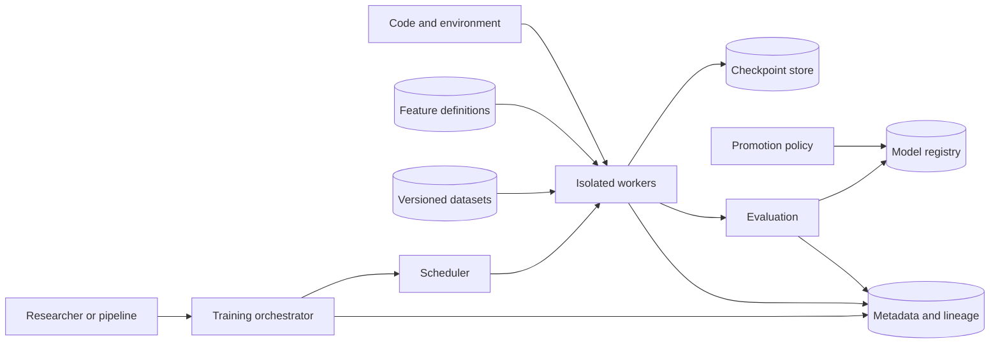

# ML Training Platform

## Purpose

Turn governed data and code into reproducible, evaluated, traceable model
artifacts while allocating heterogeneous compute safely and efficiently. The
platform separates experiment convenience from the controls required to
promote an artifact into production.

## Invariants

- Every artifact is attributable to immutable code, configuration, environment,
  input snapshot, feature definition, random seed policy, and evaluation.
- Training data access follows purpose limitation and least privilege; datasets
  and derived artifacts retain lineage and deletion obligations.
- A scheduler never allocates the same exclusive accelerator to two jobs.
- Checkpoints are atomic or versioned and validated before resumption.
- Promotion uses recorded policy and evidence; a mutable tag is not the source
  of artifact identity.
- User code runs in an isolated execution identity with bounded network,
  compute, storage, and secret access.

## Components and lifecycle

- **Orchestrator:** durable workflow state, retries, dependencies, and
  cancellation.
- **Scheduler:** queues, quotas, topology-aware placement, gang scheduling, and
  preemption.
- **Workers:** distributed training processes with pinned environments and
  workload identities.
- **Data and feature sources:** snapshot resolution, validation, and governed
  access.
- **Metadata, evaluation, and registry:** lineage, metrics, gates, signatures,
  and immutable artifact versions.

## Failure boundaries

- A worker or node failure should restart from a verified checkpoint without
  silently changing data order or world size assumptions.
- Orchestrator loss must not orphan expensive jobs or launch duplicates after
  recovery.
- Shared storage and metadata services can halt the fleet. Training should
  tolerate bounded telemetry loss but never untracked artifact publication.
- Stragglers can hold all members of a distributed job. Detect progress and
  distinguish slow input, network, accelerator, and synchronization.
- Preemption is safe only when checkpoint duration and remaining lease time are
  compatible.

## Design review questions

1. What exactly makes a run reproducible, and which nondeterministic operations
   are accepted and recorded?
2. How are data snapshots resolved, retained, revoked, and deleted downstream?
3. What fairness model applies across teams, priorities, accelerator types, and
   reserved capacity?
4. How are distributed-job membership, retries, and checkpoint compatibility
   handled?
5. Which offline metrics, robustness tests, bias checks, and approvals gate
   promotion?
6. How are cost, utilization, queue time, failed-run waste, and carbon-aware
   placement measured?

## Tradeoffs

- Fully reproducible environments improve auditability but slow dependency and
  driver upgrades.
- Aggressive preemption raises utilization but wastes work and complicates
  distributed checkpointing.
- Shared feature infrastructure reduces skew but creates a critical dependency
  and governance surface.
- Automated promotion increases throughput but requires trustworthy evaluation
  and rollback evidence; manual gates add latency and inconsistent judgment.

## Authoritative references

- [NIST AI Risk Management Framework](https://www.nist.gov/itl/ai-risk-management-framework)
- [MLflow model registry documentation](https://mlflow.org/docs/latest/ml/model-registry/)
- [Kubernetes scheduling framework](https://kubernetes.io/docs/concepts/scheduling-eviction/scheduling-framework/)
- [PyTorch distributed overview](https://pytorch.org/tutorials/beginner/dist_overview.html)
- [TensorFlow distributed training](https://www.tensorflow.org/guide/distributed_training)
- [SLSA specification](https://slsa.dev/spec/)
