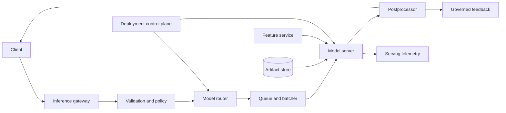

# Model Serving

## Purpose

Serve versioned model inference with bounded latency, predictable capacity,
safe rollout, and complete attribution of outputs to model, configuration, and
input contract. Serving includes preprocessing, routing, inference,
postprocessing, and feedback capture.

## Invariants

- A request resolves to an immutable model artifact and compatible runtime.
- Input validation, preprocessing, and feature semantics match the model
  contract; incompatible requests fail explicitly.
- Deadlines and cancellation cover queueing, batching, model execution, and
  downstream calls.
- Tenant quotas and admission control protect finite accelerator memory and
  concurrency.
- Rollout and rollback never depend on overwriting an artifact in place.
- Logs exclude raw sensitive prompts, features, and outputs unless a governed
  policy explicitly permits capture.

## Components and request flow

- **Gateway and policy:** authentication, quotas, request limits, and protocol
  normalization.
- **Router:** model version, hardware pool, experiment, and locality selection.
- **Queue and batcher:** deadline-aware admission and dynamic batching.
- **Model server:** artifact loading, memory management, inference, and health.
- **Control plane:** desired deployments, warm-up, canaries, and rollback.
- **Telemetry and feedback:** model-attributed service metrics and governed
  outcome signals.

## Failure boundaries

- Artifact or feature service failure should not evict already loaded healthy
  models. Cold-start dependencies need separate readiness and fallback rules.
- Oversized inputs and long generations monopolize memory and slots. Enforce
  shape, token, output, and execution limits before admission.
- Dynamic batching increases throughput but can violate tail latency when
  arrivals fall or one request is unusually expensive.
- A semantically bad model may be technically healthy. Rollout gates need
  quality and safety indicators in addition to process health.
- Feedback joins can leak tenant data or create training-serving contamination;
  use scoped identifiers and governed retention.

## Design review questions

1. What are latency, availability, throughput, and quality SLOs by model and
   request class?
2. How are model size, accelerator memory, batch shape, context length, and
   concurrency converted into capacity?
3. What is the behavior on overload, cold start, dependency timeout, and partial
   regional failure?
4. How are preprocessing and feature definitions versioned with the artifact?
5. Which canary metrics trigger automatic halt or rollback, and how quickly?
6. How are output safety controls evaluated without making them an unbounded
   serial dependency?

## Tradeoffs

- Larger batches improve throughput and cost but increase queueing and tail
  latency.
- Dedicated model pools provide isolation and predictable performance but lower
  utilization; shared pools improve utilization but add eviction and
  noisy-neighbor risk.
- Server-side feature lookup centralizes freshness but adds latency and
  dependency coupling; client-supplied features risk skew and tampering.
- Quantization and compilation reduce cost and latency but can alter quality and
  constrain hardware or model portability.

## Authoritative references

- [KServe documentation](https://kserve.github.io/website/)
- [NVIDIA Triton Inference Server documentation](https://docs.nvidia.com/deeplearning/triton-inference-server/user-guide/docs/)
- [ONNX Runtime documentation](https://onnxruntime.ai/docs/)
- [MLflow model format](https://mlflow.org/docs/latest/ml/model/)
- [Google SRE: Addressing Cascading Failures](https://sre.google/sre-book/addressing-cascading-failures/)
- [NIST AI Risk Management Framework](https://www.nist.gov/itl/ai-risk-management-framework)
