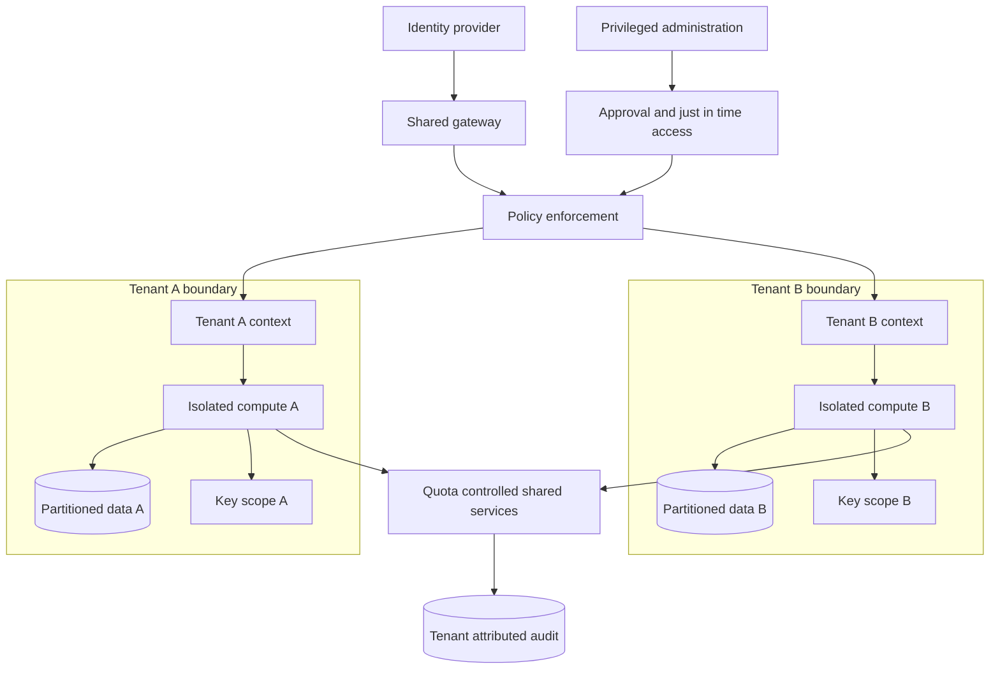

# Multi-Tenant Security Boundaries

## Purpose

Prevent one tenant from reading, modifying, inferring, or exhausting another
tenant's resources while preserving operability and efficient sharing. The
boundary spans identity, APIs, compute, network, data, encryption, telemetry,
administration, and deletion.

## Invariants

- Tenant identity comes from authenticated server-side context, never from an
  unverified body, query, label, or object name.
- Every resource has one tenant owner or is explicitly classified as shared;
  authorization is enforced at each storage and execution boundary.
- Cross-tenant access requires an explicit, time-bounded grant and produces an
  immutable audit record.
- Workload credentials are tenant-scoped and cannot request broader credentials
  through delegation.
- Shared pools enforce quotas for concurrency, compute, storage, network,
  cardinality, and control-plane operations.
- Backup, cache, search index, telemetry, derived artifact, and deletion paths
  preserve the same isolation contract as primary storage.

## Boundaries and enforcement

- **Identity and gateway:** binds principal, tenant, authentication strength,
  and request context.
- **Policy enforcement:** evaluates action, resource, tenant, environment, and
  delegated grants.
- **Compute and network boundary:** limits process, namespace, node, destination,
  metadata-service, and side-channel exposure.
- **Data and key scope:** partition keys, row policies, object prefixes,
  indexes, caches, backups, and encryption context.
- **Shared services and audit:** tenant-aware quotas and complete attribution.
- **Administration:** separate privileged identities, approval, short leases,
  session recording, and emergency-access review.

## Failure boundaries

- A missing tenant predicate in shared storage can expose all rows. Prefer
  structural enforcement such as row-level policy, tenant-bound repositories,
  and negative isolation tests.
- Cache keys, object paths, metrics labels, and search filters are common
  secondary leak paths even when the primary database is correct.
- Shared worker reuse can retain memory, disk, environment variables, model
  state, or credentials. Sanitize or destroy execution environments between
  trust domains.
- Noisy neighbors can cause availability loss or timing inference. Enforce
  quotas at admission and at each scarce downstream pool.
- Operator tools often bypass normal policy. Make support access narrow,
  approved, visible to the tenant where appropriate, and automatically expired.

## Design review questions

1. Where is tenant context established, cryptographically bound, propagated,
   and revalidated?
2. Which components are shared, partitioned, pooled, or dedicated, and what
   evidence supports each isolation level?
3. Can any identifier, cache key, log query, export, backup restore, or error
   message cross a tenant boundary?
4. How are per-tenant limits enforced when requests fan out to shared
   dependencies?
5. What is the complete offboarding and cryptographic deletion procedure,
   including replicas, backups, and derived data?
6. How are support access, break-glass use, policy changes, and attempted
   cross-tenant access detected and reviewed?

## Tradeoffs

- Dedicated infrastructure maximizes fault and security isolation but increases
  cost, fragmentation, and operational variance.
- Shared-schema storage improves utilization and fleet management but makes
  every query and index an isolation concern.
- Per-tenant encryption keys strengthen revocation and audit separation but add
  key lifecycle, caching, and throughput complexity.
- Rich centralized telemetry improves operations but concentrates metadata and
  requires strict query authorization and retention controls.

## Authoritative references

- [NIST SP 800-207: Zero Trust Architecture](https://csrc.nist.gov/pubs/sp/800/207/final)
- [NIST SP 800-53 Rev. 5](https://csrc.nist.gov/pubs/sp/800/53/r5/upd1/final)
- [OWASP Authorization Cheat Sheet](https://cheatsheetseries.owasp.org/cheatsheets/Authorization_Cheat_Sheet.html)
- [OWASP Multi-Tenant Security Cheat Sheet](https://cheatsheetseries.owasp.org/cheatsheets/Multi_Tenant_Security_Cheat_Sheet.html)
- [SPIFFE specifications](https://spiffe.io/docs/latest/spiffe-about/overview/)
- [CIS Kubernetes Benchmark](https://www.cisecurity.org/benchmark/kubernetes)
