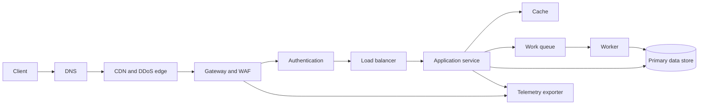

# Request Path

## Purpose

Carry a client operation from the public edge to an application handler and
back with bounded latency, explicit identity, overload protection, and enough
context to diagnose the result. The path includes every queue and remote call;
it does not end at the first application process.

## Invariants

- The request has a single end-to-end deadline. Each hop receives a smaller
  budget and stops work after cancellation.
- Authentication establishes identity; authorization is repeated at the
  resource boundary using server-controlled attributes.
- Retryable operations are idempotent or carry an idempotency key. Retry count
  and backoff are bounded by the deadline.
- Untrusted input is size-limited and validated before expensive work.
- Trace context and a stable request identifier cross every supported hop;
  secrets and raw credentials do not enter logs.
- Admission control sheds excess work before finite pools are exhausted.

## Components and flow

- **DNS and edge:** endpoint selection, TLS termination policy, caching, and
  coarse traffic filtering.
- **Gateway and WAF:** request limits, routing, protocol normalization, and
  tenant-aware rate limits.
- **Application service:** authorization, orchestration, deadline propagation,
  and response construction.
- **Cache, queue, and data store:** distinct consistency and latency contracts.
- **Telemetry exporter:** non-blocking trace, metric, and structured-log
  emission.

## Failure boundaries

- Edge or DNS failure can remove an entire region before application health is
  relevant. Multi-region routing needs independent health evidence.
- A gateway retry can multiply a service retry. Permit one layer to retry a
  given call and account for the total attempt budget.
- Queueing hides overload until latency spikes. Bound queue depth and expose
  queue time separately from service time.
- Cache failure must have an explicit mode: fail closed, bypass with protected
  origin capacity, or serve bounded-stale data.
- Partial success after a client timeout creates ambiguous outcomes. Provide
  operation status lookup or idempotent replay for mutations.

## Design review questions

1. What are the p50, p95, and p99 latency objectives, and how is the deadline
   divided among queueing, compute, and dependencies?
2. Which operations are safe to retry, and where is deduplication state kept?
3. What is the maximum request body, fan-out, concurrency, and response size?
4. Which identity claims are trusted at each hop, and how are they protected
   from client spoofing?
5. What happens when the cache, identity provider, telemetry sink, or primary
   store is slow rather than unavailable?
6. How are canaries, drains, connection reuse, and rollback tested?

## Tradeoffs

- Edge caching lowers latency and origin load but complicates invalidation,
  privacy, and cache-key correctness.
- Synchronous calls simplify outcome semantics but couple availability and
  latency; queues absorb bursts but introduce eventual completion and
  deduplication work.
- Aggressive retries improve isolated transient failures but amplify overload.
- Fine-grained authorization improves containment but adds policy evaluation
  latency and dependency risk.

## Authoritative references

- [RFC 9110: HTTP Semantics](https://www.rfc-editor.org/rfc/rfc9110)
- [RFC 9111: HTTP Caching](https://www.rfc-editor.org/rfc/rfc9111)
- [RFC 9000: QUIC](https://www.rfc-editor.org/rfc/rfc9000)
- [OpenTelemetry trace semantic conventions](https://opentelemetry.io/docs/specs/semconv/http/http-spans/)
- [Google SRE: Handling Overload](https://sre.google/sre-book/handling-overload/)
- [OWASP API Security Top 10](https://owasp.org/API-Security/)
