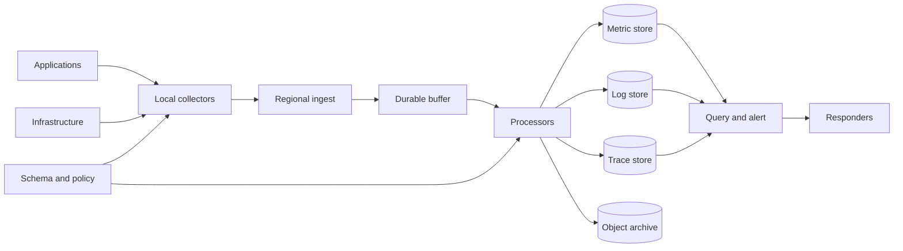

# Telemetry Pipeline

## Purpose

Move metrics, logs, traces, profiles, and audit events from producers to
operational and analytical consumers with known loss, delay, cost, and privacy
properties. Telemetry must remain useful during incidents without becoming a
new dependency on the serving path.

## Invariants

- Application success does not synchronously depend on a remote telemetry
  backend, except for explicitly classified durable audit events.
- Every signal has an owner, retention class, access policy, and deletion path.
- Resource identity, clock source, schema version, and tenant are consistently
  attached at collection.
- Cardinality and event size are bounded before shared ingestion.
- Backpressure ends in a declared policy: bounded buffering, sampling, dropping,
  or durable spooling.
- Sensitive fields are minimized or redacted before leaving the workload trust
  boundary.

## Components and flow

- **Instrumentation:** semantic events, correlation context, and measurements at
  the source.
- **Local collectors:** batching, enrichment, filtering, redaction, retries, and
  isolation from backend outages.
- **Ingest and buffer:** authentication, tenant quotas, sequencing where
  required, and burst absorption.
- **Processors and stores:** sampling, aggregation, indexing, retention, and
  archival by signal.
- **Query and alert:** dashboards, detection rules, SLO calculations, and
  incident investigation.

## Failure boundaries

- Collector memory or disk exhaustion can affect colocated workloads. Enforce
  hard resource limits and a deliberate drop order.
- Ingest failure creates blind spots precisely during an incident. Monitor the
  telemetry system from an independent path and expose dropped-item counters.
- High-cardinality labels can exhaust shared storage and query capacity. Reject
  or transform them at the earliest enforceable point.
- Clock skew breaks ordering and latency analysis. Preserve source timestamps
  and ingestion timestamps, and monitor synchronization.
- Tail sampling improves rare-trace retention but requires buffering complete
  traces and handling late spans.

## Design review questions

1. Which questions must each signal answer, and what signal can be removed?
2. What loss and freshness SLO applies in normal operation and under peak load?
3. What are the per-tenant byte, event, cardinality, query, and retention
   budgets?
4. Where are credentials, personal data, and customer content redacted?
5. Can operators detect collector drops, delayed partitions, bad clocks, and
   incomplete traces?
6. How are schema changes rolled out across mixed producer and consumer
   versions?

## Tradeoffs

- More detail improves diagnosis but raises cost, privacy exposure, and query
  complexity.
- Head sampling is cheap and immediate but may discard rare failures; tail
  sampling is selective but stateful and delayed.
- A shared pipeline simplifies standards and correlation but increases
  common-mode and noisy-neighbor risk.
- Long retention aids forensics and capacity analysis but expands cost and
  governance obligations.

## Authoritative references

- [OpenTelemetry specification](https://opentelemetry.io/docs/specs/otel/)
- [OpenTelemetry Protocol specification](https://opentelemetry.io/docs/specs/otlp/)
- [W3C Trace Context](https://www.w3.org/TR/trace-context/)
- [Prometheus instrumentation practices](https://prometheus.io/docs/practices/instrumentation/)
- [Google SRE: Monitoring Distributed Systems](https://sre.google/sre-book/monitoring-distributed-systems/)
- [NIST SP 800-92: Log Management](https://csrc.nist.gov/pubs/sp/800/92/final)
