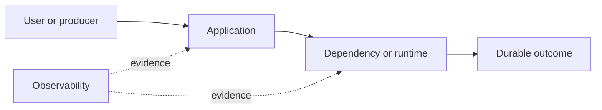

# Drill: Memory Exhaustion and OOM Kill

> **Difficulty:** Intermediate  
> **Focus:** Linux memory pressure, cgroups, heap growth  
> **Rule:** Investigate before opening [solution.md](solution.md).

## Context

A Go image-processing API runs in containers with a 1 GiB memory limit. At 09:20 UTC, large uploads begin failing while small requests remain mostly healthy.

This is a synthetic exercise. Names, addresses, IDs, and values are fictional.

## Learner role

You are the primary on-call for the image API. A platform engineer can inspect nodes, but only you may change the service deployment.

## Symptoms

- Pods restart without an application panic
- Large requests fail with connection resets
- RSS climbs faster than request throughput

## Available evidence

The snapshots are intentionally incomplete. Ask what each signal proves and what it cannot prove.

### Logs

```text
09:22:14 gateway ERROR upstream reset route=/render request_id=r-8841
09:22:15 kubelet INFO Container image-api failed liveness probe
09:22:16 kernel INFO Memory cgroup out of memory: Killed process 3187 (image-api)
09:22:17 pod status container=api lastState.reason=OOMKilled exitCode=137
```

### Metrics

| Signal | Incident | Baseline |
|---|---:|---:|
| `container_memory_working_set_bytes` | 1012 MiB | 780 MiB |
| `container_spec_memory_limit_bytes` | 1024 MiB | 1024 MiB |
| `go_memstats_heap_inuse_bytes` | 690 MiB | 410 MiB |
| `request_rate` | 82/s | 79/s |

### System map



## Timeline

| Time (UTC) | Event |
|---|---|
| 09:18 | Batch client starts high-resolution uploads |
| 09:20 | P99 latency and RSS rise |
| 09:22 | First container exits with code 137 |
| 09:25 | Restart count alert fires |

## Investigation tasks

1. Prove whether the kernel, a cgroup, or the application terminated the process.
2. Separate heap, native, page-cache, and node-level pressure hypotheses.
3. Correlate memory growth with request shape and concurrency.
4. Choose a mitigation that limits impact without hiding a leak.
5. Define recovery proof across at least two workload cycles.

Record work as evidence, not conclusions:

| Hypothesis | Supporting evidence | Contradicting evidence | Discriminating test | Result |
|---|---|---|---|---|
|  |  |  |  |  |

## Decision points

- Do you reduce concurrency, reject oversized work, raise the limit, or restart first? State the evidence required.
- If the node has free memory, does that make a limit increase safe?
- What evidence must be captured before recycling a pod?

For every choice, state blast radius, reversibility, expected signal, owner, and rollback trigger.

## Mitigation and recovery

Expected mitigation direction: Protect capacity first: cap expensive concurrency or request size, shed excess work, and drain affected pods one at a time. Raise limits only after validating node headroom and the service’s expected working set.

Recovery must be proved, not inferred from one green check:

- No OOM kills or restart growth through two peak workload cycles
- Memory returns to a stable baseline after expensive requests
- Large and small request SLOs recover without node pressure

## Prevention

Propose and prioritize controls in these areas:

- Load-test representative payload sizes and concurrency
- Alert on working-set headroom and OOM events, not only node memory
- Continuously profile heap and native allocations
- Set request limits and admission controls from measured cost

Each action needs an owner, measurable acceptance criterion, and review date.

## Debrief

1. Which observation most changed your hypothesis ranking?
2. Which action was safest under uncertainty, and why?
3. What evidence did you nearly destroy during mitigation?
4. Which alert detected impact, and which signal would detect the cause sooner?
5. What would make this drill harder without making it ambiguous?

## Authoritative sources

- [Linux cgroup v2 memory controller](https://docs.kernel.org/admin-guide/cgroup-v2.html#memory)
- [Kubernetes resource management](https://kubernetes.io/docs/concepts/configuration/manage-resources-containers/)
- [Go diagnostics](https://go.dev/doc/diagnostics)
