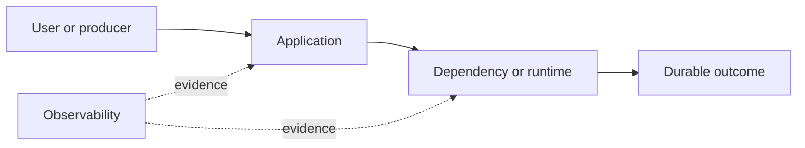

# Drill: Disk Exhaustion

> **Difficulty:** Intermediate  
> **Focus:** Capacity, inodes, deleted-open files  
> **Rule:** Investigate before opening [solution.md](solution.md).

## Context

A stateful reporting service writes temporary exports to `/var/lib/reporter`. At 03:40 UTC, report generation and unrelated local writes begin failing.

This is a synthetic exercise. Names, addresses, IDs, and values are fictional.

## Learner role

You are host and service on-call. You may stop new exports and rotate service-owned files, but must not delete unknown data.

## Symptoms

- Writes fail with `ENOSPC`
- Filesystem utilization is 100 percent
- A recent log rotation did not recover visible space

## Available evidence

The snapshots are intentionally incomplete. Ask what each signal proves and what it cannot prove.

### Logs

```text
03:40:02 reporter ERROR write /var/lib/reporter/tmp/e-928.csv: no space left on device
03:40:03 postgres WARN could not write lock file: No space left on device
03:41:10 logrotate INFO rotated /var/log/reporter/export.log
03:42:00 reporter ERROR export e-929 aborted bytes_written=734003200
```

### Metrics

| Signal | Incident | Baseline |
|---|---:|---:|
| `node_filesystem_avail_bytes{mountpoint="/var"}` | 0.4 GiB | 18 GiB |
| `node_filesystem_files_free` | 61% | 62% |
| `report_exports_active` | 14 | 3 |
| `process_open_fds` | 488 | 220 |

### System map



## Timeline

| Time (UTC) | Event |
|---|---|
| 03:10 | Export concurrency raised from 4 to 16 |
| 03:31 | Available bytes fall below 5 percent |
| 03:40 | First ENOSPC |
| 03:41 | Log file rotated; space remains unavailable |

## Investigation tasks

1. Identify the exact filesystem and whether bytes, inodes, or quota are exhausted.
2. Account for growth by directory and deleted-open files.
3. Determine which writes are durability-critical before cleanup.
4. Design a reversible space-recovery sequence.
5. Prove filesystem and application recovery.

Record work as evidence, not conclusions:

| Hypothesis | Supporting evidence | Contradicting evidence | Discriminating test | Result |
|---|---|---|---|---|
|  |  |  |  |  |

## Decision points

- Pause producers or delete files first?
- Is truncating an open log acceptable?
- How much emergency headroom is enough before restarting writers?

For every choice, state blast radius, reversibility, expected signal, owner, and rollback trigger.

## Mitigation and recovery

Expected mitigation direction: Pause new exports, reserve space for durability-critical components, remove only verified disposable temporary files, and restart or signal the process holding deleted files after capturing ownership evidence.

Recovery must be proved, not inferred from one green check:

- Sustained free-byte headroom above the defined threshold
- No ENOSPC in service or co-located dependencies
- A canary export completes and cleanup removes its temporary data

## Prevention

Propose and prioritize controls in these areas:

- Bound export concurrency and temporary-file size
- Alert on bytes, inodes, quotas, and projected time to full
- Place disposable exports on an isolated filesystem
- Verify rotation reopens file descriptors

Each action needs an owner, measurable acceptance criterion, and review date.

## Debrief

1. Which observation most changed your hypothesis ranking?
2. Which action was safest under uncertainty, and why?
3. What evidence did you nearly destroy during mitigation?
4. Which alert detected impact, and which signal would detect the cause sooner?
5. What would make this drill harder without making it ambiguous?

## Authoritative sources

- [GNU Coreutils df](https://www.gnu.org/software/coreutils/manual/html_node/df-invocation.html)
- [Linux open(2)](https://man7.org/linux/man-pages/man2/open.2.html)
- [Linux lsof manual](https://man7.org/linux/man-pages/man8/lsof.8.html)
