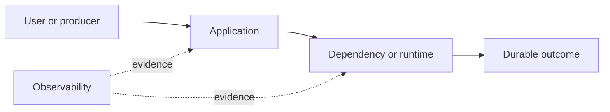

# Drill: TLS Certificate Expiry

> **Difficulty:** Intermediate  
> **Focus:** Certificate paths, time, renewal  
> **Rule:** Investigate before opening [solution.md](solution.md).

## Context

At 00:05 UTC, mobile clients reject `checkout.example.test`; some internal probes still report healthy.

This is a synthetic exercise. Names, addresses, IDs, and values are fictional.

## Learner role

You are checkout on-call coordinating with PKI and edge teams. You may deploy an approved certificate but may not disable verification.

## Symptoms

- Client handshakes fail after midnight
- Failures vary by connection reuse and endpoint
- Plain TCP reachability remains healthy

## Available evidence

The snapshots are intentionally incomplete. Ask what each signal proves and what it cannot prove.

### Logs

```text
00:05:11 mobile ERROR request failed host=checkout.example.test error="certificate has expired"
00:05:12 edge INFO tls_handshake_error sni=checkout.example.test remote=203.0.113.42
00:06:00 probe INFO endpoint=10.2.4.17 health=ok protocol=http
00:07:03 renewer WARN certificate order valid but deployment target edge-prod not updated
```

### Metrics

| Signal | Incident | Baseline |
|---|---:|---:|
| `tls_handshake_failures_total` | 1,842/5m | 4/5m |
| `http_requests_total` | down 71% | baseline |
| `tcp_connect_success` | 99.99% | 99.99% |
| `certificate_not_after_seconds` | -423 | 2,592,000 |

### System map



## Timeline

| Time (UTC) | Event |
|---|---|
| Previous day 23:45 | Renewal order completes |
| 00:00 | Served leaf certificate expires |
| 00:05 | Fresh clients fail |
| 00:07 | Deployment warning found |

## Investigation tasks

1. Capture the chain served from each endpoint and SNI path.
2. Check validity against trusted time and distinguish leaf, intermediate, hostname, and trust failures.
3. Explain why reused connections or HTTP probes differ.
4. Plan certificate deployment and rollback.
5. Verify externally with fresh handshakes.

Record work as evidence, not conclusions:

| Hypothesis | Supporting evidence | Contradicting evidence | Discriminating test | Result |
|---|---|---|---|---|
|  |  |  |  |  |

## Decision points

- Redeploy the renewed certificate or route to another edge?
- Should caches or clients be asked to bypass verification?
- What proves every edge shard has converged?

For every choice, state blast radius, reversibility, expected signal, owner, and rollback trigger.

## Mitigation and recovery

Expected mitigation direction: Deploy the already-issued certificate and full intended chain through the controlled edge configuration, canary one shard, then roll out. If deployment is unsafe, route to an endpoint serving a valid chain.

Recovery must be proved, not inferred from one green check:

- Fresh handshakes succeed with correct SNI from representative networks
- Served serial and `notAfter` match the approved certificate on every shard
- Handshake failures and user transactions return to baseline

## Prevention

Propose and prioritize controls in these areas:

- Alert on externally served certificate lifetime, not only issuance
- Exercise renewal deployment and rollback
- Inventory SNI names and edge targets
- Use synthetic checks that validate chain and hostname

Each action needs an owner, measurable acceptance criterion, and review date.

## Debrief

1. Which observation most changed your hypothesis ranking?
2. Which action was safest under uncertainty, and why?
3. What evidence did you nearly destroy during mitigation?
4. Which alert detected impact, and which signal would detect the cause sooner?
5. What would make this drill harder without making it ambiguous?

## Authoritative sources

- [RFC 5280: PKIX certificate profile](https://www.rfc-editor.org/rfc/rfc5280)
- [RFC 8446: TLS 1.3](https://www.rfc-editor.org/rfc/rfc8446)
- [OWASP TLS cheat sheet](https://cheatsheetseries.owasp.org/cheatsheets/Transport_Layer_Security_Cheat_Sheet.html)
