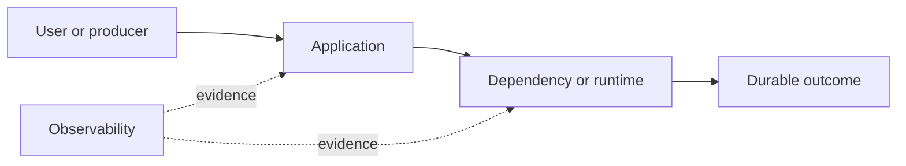

# Drill: Database Pool Exhaustion

> **Difficulty:** Advanced  
> **Focus:** Connection ownership, transactions, backpressure  
> **Rule:** Investigate before opening [solution.md](solution.md).

## Context

An order API uses a 60-connection PostgreSQL pool. Requests begin timing out although database CPU and query latency remain moderate.

This is a synthetic exercise. Names, addresses, IDs, and values are fictional.

## Learner role

You are application on-call. A DBA can provide server views; schema or database restarts require joint approval.

## Symptoms

- Threads wait for a pool connection
- Database CPU is only 35 percent
- One endpoint was deployed shortly before impact

## Available evidence

The snapshots are intentionally incomplete. Ask what each signal proves and what it cannot prove.

### Logs

```text
16:13:01 orders ERROR acquire connection timeout after=2000ms route=/orders/search
16:13:02 orders WARN pool active=60 idle=0 pending=417 max=60
16:13:05 postgres LOG duration: 18.2 ms statement: SELECT ...
16:13:09 orders INFO request cancelled route=/export client_closed=true
```

### Metrics

| Signal | Incident | Baseline |
|---|---:|---:|
| `db_pool_active` | 60 | 22 |
| `db_pool_pending` | 417 | 0 |
| `db_query_duration_p95` | 41 ms | 38 ms |
| `postgres_connections` | 68 | 30 |

### System map



## Timeline

| Time (UTC) | Event |
|---|---|
| 15:55 | Streaming export release reaches 100 percent |
| 16:08 | Export usage rises |
| 16:13 | Pool pending queue spikes |
| 16:15 | Order error-budget alert fires |

## Investigation tasks

1. Separate server connection limits, slow queries, leaks, and long-held transactions.
2. Attribute checked-out connections to routes and request lifetimes.
3. Inspect transaction state and cancellation cleanup.
4. Select safe load shedding or rollback.
5. Verify that pool turnover recovers.

Record work as evidence, not conclusions:

| Hypothesis | Supporting evidence | Contradicting evidence | Discriminating test | Result |
|---|---|---|---|---|
|  |  |  |  |  |

## Decision points

- Increase pool size, rollback, or cap exports?
- May active exports be cancelled?
- How do you avoid shifting failure to PostgreSQL?

For every choice, state blast radius, reversibility, expected signal, owner, and rollback trigger.

## Mitigation and recovery

Expected mitigation direction: Stop or limit new streaming exports, rollback the faulty release if safe, and allow healthy requests to regain pool access. Cancel only identified export sessions using the normal cancellation path.

Recovery must be proved, not inferred from one green check:

- Pool pending returns to zero with healthy idle reserve
- Normal routes meet latency SLO
- Database connections and lock waits remain below limits
- Cancelled requests release connections promptly

## Prevention

Propose and prioritize controls in these areas:

- Scope connection and transaction lifetimes explicitly
- Test client cancellation and streaming backpressure
- Use per-workload concurrency limits
- Alert on pool wait and connection hold time by route

Each action needs an owner, measurable acceptance criterion, and review date.

## Debrief

1. Which observation most changed your hypothesis ranking?
2. Which action was safest under uncertainty, and why?
3. What evidence did you nearly destroy during mitigation?
4. Which alert detected impact, and which signal would detect the cause sooner?
5. What would make this drill harder without making it ambiguous?

## Authoritative sources

- [PostgreSQL monitoring statistics](https://www.postgresql.org/docs/current/monitoring-stats.html)
- [PostgreSQL client connection defaults](https://www.postgresql.org/docs/current/runtime-config-connection.html)
- [Google SRE overload handling](https://sre.google/sre-book/handling-overload/)
