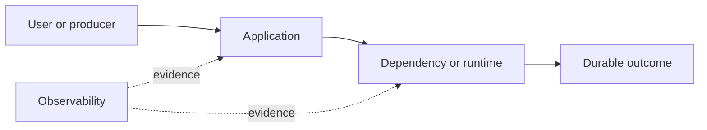

# Drill: Bad Rollout

> **Difficulty:** Intermediate  
> **Focus:** Canaries, version correlation, rollback  
> **Rule:** Investigate before opening [solution.md](solution.md).

## Context

Version `2026.08.23.4` of a pricing service reaches 30 percent of instances. Checkout totals become intermittently incorrect.

This is a synthetic exercise. Names, addresses, IDs, and values are fictional.

## Learner role

You are incident commander. Release engineering owns deployment controls; product must approve any pricing fallback.

## Symptoms

- Errors occur only on a subset of requests
- Latency is normal
- Failures correlate with one version and one currency path

## Available evidence

The snapshots are intentionally incomplete. Ask what each signal proves and what it cannot prove.

### Logs

```text
11:02:10 pricing INFO version=2026.08.23.4 currency=JPY subtotal=1280 discount=0.15 total=1087
11:02:10 checkout ERROR invariant violated expected_minor_units=true pricing_version=2026.08.23.4
11:02:11 pricing INFO version=2026.08.23.3 currency=JPY subtotal=1280 discount=0.15 total=1088
11:03:00 deploy INFO desired=30% ready=30% analysis=passing
```

### Metrics

| Signal | Incident | Baseline |
|---|---:|---:|
| `pricing_invariant_failures{version=".4"}` | 6.8% | 0% |
| `pricing_invariant_failures{version=".3"}` | 0% | 0% |
| `request_latency_p95` | 42 ms | 44 ms |
| `deployment_fraction{version=".4"}` | 30% | 0% |

### System map



## Timeline

| Time (UTC) | Event |
|---|---|
| 10:50 | Canary begins at 5 percent |
| 10:57 | Automated latency analysis passes |
| 11:00 | Rollout reaches 30 percent |
| 11:02 | Checkout invariant alert fires |

## Investigation tasks

1. Quantify impact by version, currency, and route.
2. Confirm causality without assuming temporal correlation is enough.
3. Identify why rollout analysis missed the signal.
4. Choose halt, rollback, or forward fix.
5. Reconcile potentially wrong transactions.

Record work as evidence, not conclusions:

| Hypothesis | Supporting evidence | Contradicting evidence | Discriminating test | Result |
|---|---|---|---|---|
|  |  |  |  |  |

## Decision points

- Halt versus rollback immediately?
- Can traffic be pinned safely?
- Which completed orders need audit and customer remediation?

For every choice, state blast radius, reversibility, expected signal, owner, and rollback trigger.

## Mitigation and recovery

Expected mitigation direction: Halt progression, route new traffic to the last known-good version, then roll back using the normal deployment mechanism. Preserve request IDs for transaction reconciliation.

Recovery must be proved, not inferred from one green check:

- All serving instances report the known-good digest
- Invariant failures cease for the affected path
- Representative JPY transactions produce expected minor units
- Impacted orders are enumerated and reconciled

## Prevention

Propose and prioritize controls in these areas:

- Analyze business invariants in canaries
- Segment canary traffic across critical currencies and features
- Use immutable artifact digests and version labels
- Automate transaction reconciliation for pricing anomalies

Each action needs an owner, measurable acceptance criterion, and review date.

## Debrief

1. Which observation most changed your hypothesis ranking?
2. Which action was safest under uncertainty, and why?
3. What evidence did you nearly destroy during mitigation?
4. Which alert detected impact, and which signal would detect the cause sooner?
5. What would make this drill harder without making it ambiguous?

## Authoritative sources

- [Kubernetes deployment rollouts](https://kubernetes.io/docs/concepts/workloads/controllers/deployment/#updating-a-deployment)
- [Google SRE canarying releases](https://sre.google/workbook/canarying-releases/)
- [ISO 4217 currency codes](https://www.iso.org/iso-4217-currency-codes.html)
