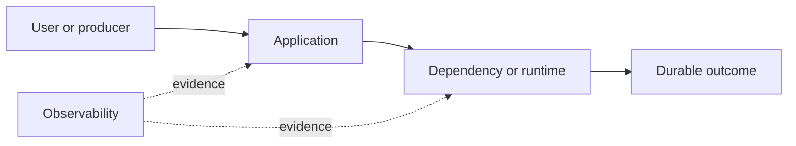

# Drill: Kubernetes CrashLoopBackOff

> **Difficulty:** Intermediate  
> **Focus:** Pod lifecycle, probes, configuration  
> **Rule:** Investigate before opening [solution.md](solution.md).

## Context

A newly scheduled payments pod repeatedly restarts. Existing replicas serve traffic, but capacity is falling during node maintenance.

This is a synthetic exercise. Names, addresses, IDs, and values are fictional.

## Learner role

You are Kubernetes workload on-call. You can inspect workload objects and roll back deployments; cluster-admin changes require platform review.

## Symptoms

- Pod status shows `CrashLoopBackOff`
- Container termination exit code is 1
- Only newly created pods fail

## Available evidence

The snapshots are intentionally incomplete. Ask what each signal proves and what it cannot prove.

### Logs

```text
07:31:04 payments INFO starting version=sha256:4f2...
07:31:04 payments ERROR config validation failed: PAYMENT_TIMEOUT must be positive
07:31:05 kubelet INFO Back-off restarting failed container payments
07:31:36 pod status waiting.reason=CrashLoopBackOff restartCount=6
```

### Metrics

| Signal | Incident | Baseline |
|---|---:|---:|
| `kube_pod_container_status_restarts_total` | 6 | 0 |
| `kube_deployment_status_replicas_available` | 5 | 8 |
| `container_start_time_seconds` | changes repeatedly | stable |
| `http_probe_failures` | not observed | 0 |

### System map



## Timeline

| Time (UTC) | Event |
|---|---|
| 07:20 | ConfigMap revision deployed |
| 07:25 | Node drain starts |
| 07:31 | Replacement pod exits |
| 07:33 | Backoff reaches 40 seconds |

## Investigation tasks

1. Use current and previous container state to identify the termination cause.
2. Distinguish app exit, OOM kill, probe kill, image failure, and scheduling failure.
3. Compare config and identity between healthy and failing pods.
4. Restore replicas without bypassing validation.
5. Verify rollout health and capacity.

Record work as evidence, not conclusions:

| Hypothesis | Supporting evidence | Contradicting evidence | Discriminating test | Result |
|---|---|---|---|---|
|  |  |  |  |  |

## Decision points

- Rollback ConfigMap consumer, patch value, or pause node drain?
- Should the liveness probe be relaxed?
- How will immutable and mutable configuration be coordinated?

For every choice, state blast radius, reversibility, expected signal, owner, and rollback trigger.

## Mitigation and recovery

Expected mitigation direction: Pause voluntary capacity reduction, restore the last valid configuration or deployment revision, and let the controller replace failed pods. Do not weaken probes when the process exits itself.

Recovery must be proved, not inferred from one green check:

- Desired and available replicas converge
- Restart counters stop increasing
- New pods pass startup and readiness checks
- Payments SLO remains healthy during resumed maintenance

## Prevention

Propose and prioritize controls in these areas:

- Validate configuration in CI and admission workflows
- Version configuration with deployments
- Alert on available replicas and restart rate
- Exercise replacement pods before node maintenance

Each action needs an owner, measurable acceptance criterion, and review date.

## Debrief

1. Which observation most changed your hypothesis ranking?
2. Which action was safest under uncertainty, and why?
3. What evidence did you nearly destroy during mitigation?
4. Which alert detected impact, and which signal would detect the cause sooner?
5. What would make this drill harder without making it ambiguous?

## Authoritative sources

- [Kubernetes pod lifecycle](https://kubernetes.io/docs/concepts/workloads/pods/pod-lifecycle/)
- [Kubernetes ConfigMaps](https://kubernetes.io/docs/concepts/configuration/configmap/)
- [Kubernetes debugging applications](https://kubernetes.io/docs/tasks/debug/debug-application/)
