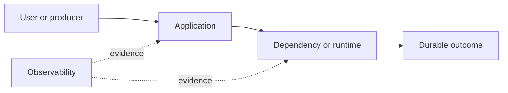

# Drill: Retry Storm

> **Difficulty:** Advanced  
> **Focus:** Backoff, retry budgets, load amplification  
> **Rule:** Investigate before opening [solution.md](solution.md).

## Context

A catalog dependency has a brief latency event. Ten minutes later, traffic to it remains four times normal despite original request volume returning to baseline.

This is a synthetic exercise. Names, addresses, IDs, and values are fictional.

## Learner role

You are reliability lead for the calling services. Dependency owners control catalog capacity; edge owners can shed optional requests.

## Symptoms

- Downstream request rate greatly exceeds user request rate
- Timeouts synchronize in waves
- Recovery attempts increase load

## Available evidence

The snapshots are intentionally incomplete. Ask what each signal proves and what it cannot prove.

### Logs

```text
18:00:00 client WARN catalog timeout attempt=1 timeout_ms=500
18:00:00 client WARN catalog timeout attempt=2 delay_ms=0
18:00:01 client WARN catalog timeout attempt=3 delay_ms=0
18:00:01 catalog WARN queue_depth=840 active=200 rejected=391
18:00:02 client ERROR request failed attempts=4 elapsed_ms=2012
```

### Metrics

| Signal | Incident | Baseline |
|---|---:|---:|
| `edge_requests` | 10k/s | 10k/s |
| `catalog_requests` | 41k/s | 11k/s |
| `catalog_queue_depth` | 840 | 20 |
| `retry_ratio` | 3.1 | 0.1 |

### System map



## Timeline

| Time (UTC) | Event |
|---|---|
| 17:58 | Catalog cache node pauses for 20 seconds |
| 18:00 | Caller timeouts synchronize |
| 18:01 | Immediate retries amplify load |
| 18:08 | Cache node healthy; queues remain saturated |

## Investigation tasks

1. Calculate amplification and identify retrying callers.
2. Inspect retry count, deadline, backoff, jitter, and retryable status policy.
3. Separate original from retry traffic.
4. Choose where to shed load and how to avoid another synchronized wave.
5. Prove stable recovery under normal traffic.

Record work as evidence, not conclusions:

| Hypothesis | Supporting evidence | Contradicting evidence | Discriminating test | Result |
|---|---|---|---|---|
|  |  |  |  |  |

## Decision points

- Disable retries, reduce attempts, or rate-limit callers?
- Which operations are safe to retry?
- How should a retry budget be allocated across layers?

For every choice, state blast radius, reversibility, expected signal, owner, and rollback trigger.

## Mitigation and recovery

Expected mitigation direction: Disable or sharply cap retries for optional reads, enforce end-to-end deadlines, shed low-priority work, and restore traffic gradually with exponential backoff and jitter.

Recovery must be proved, not inferred from one green check:

- Downstream-to-original request ratio returns near one
- Queues drain and remain bounded
- Latency and success SLO recover without oscillation
- No caller layer independently re-amplifies requests

## Prevention

Propose and prioritize controls in these areas:

- Use capped exponential backoff with jitter
- Define one retry-owning layer and a retry budget
- Honor end-to-end deadlines
- Load-test dependency failure and recovery

Each action needs an owner, measurable acceptance criterion, and review date.

## Debrief

1. Which observation most changed your hypothesis ranking?
2. Which action was safest under uncertainty, and why?
3. What evidence did you nearly destroy during mitigation?
4. Which alert detected impact, and which signal would detect the cause sooner?
5. What would make this drill harder without making it ambiguous?

## Authoritative sources

- [AWS Builders Library: timeouts and backoff](https://aws.amazon.com/builders-library/timeouts-retries-and-backoff-with-jitter/)
- [Google SRE overload handling](https://sre.google/sre-book/handling-overload/)
- [RFC 9110 Retry-After](https://www.rfc-editor.org/rfc/rfc9110.html#name-retry-after)
