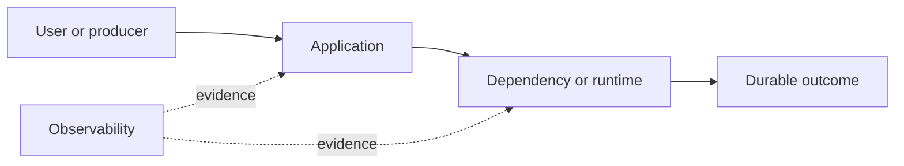

# Drill: Database Deadlock

> **Difficulty:** Advanced  
> **Focus:** Lock graphs, transaction ordering, retries  
> **Rule:** Investigate before opening [solution.md](solution.md).

## Context

Concurrent transfers between accounts intermittently fail. PostgreSQL reports deadlocks while most transactions complete normally.

This is a synthetic exercise. Names, addresses, IDs, and values are fictional.

## Learner role

You are payments application on-call paired with the DBA. Data correctness takes priority over throughput.

## Symptoms

- Some transactions abort with SQLSTATE 40P01
- Failures cluster on opposite-direction transfers
- Database CPU and connection counts are normal

## Available evidence

The snapshots are intentionally incomplete. Ask what each signal proves and what it cannot prove.

### Logs

```text
12:14:22 postgres ERROR deadlock detected
12:14:22 postgres DETAIL Process 812 waits for ShareLock on transaction 991; blocked by 813.
12:14:22 postgres DETAIL Process 813 waits for ShareLock on transaction 990; blocked by 812.
12:14:22 transfer ERROR sqlstate=40P01 from=42 to=17 request_id=t-a18
```

### Metrics

| Signal | Incident | Baseline |
|---|---:|---:|
| `db_deadlocks_total` | 37/5m | 0 |
| `transaction_latency_p99` | 4.8 s | 90 ms |
| `db_cpu` | 28% | 30% |
| `transfer_rate` | unchanged | unchanged |

### System map



## Timeline

| Time (UTC) | Event |
|---|---|
| 12:00 | Parallel transfer worker enabled |
| 12:12 | Opposite-direction batch begins |
| 12:14 | Deadlock detector aborts transactions |
| 12:16 | Payment failure alert fires |

## Investigation tasks

1. Construct the wait-for graph from deadlock details.
2. Identify statements and lock acquisition order for each transaction.
3. Distinguish a deadlock from long lock waits.
4. Choose safe handling for aborted transfers.
5. Prove correctness and liveness after remediation.

Record work as evidence, not conclusions:

| Hypothesis | Supporting evidence | Contradicting evidence | Discriminating test | Result |
|---|---|---|---|---|
|  |  |  |  |  |

## Decision points

- Retry aborted transactions automatically?
- Pause all transfers or only the parallel batch?
- Which deterministic lock order avoids cycles?

For every choice, state blast radius, reversibility, expected signal, owner, and rollback trigger.

## Mitigation and recovery

Expected mitigation direction: Pause the triggering parallel batch, let PostgreSQL abort deadlock victims, and retry only idempotent whole transactions with bounded jitter after confirming request identity.

Recovery must be proved, not inferred from one green check:

- Deadlock counter stops increasing
- All transfer request IDs have exactly one committed outcome
- Latency returns to baseline
- Opposite-direction concurrency test completes

## Prevention

Propose and prioritize controls in these areas:

- Acquire account locks in stable account-ID order
- Keep transactions short
- Make retries idempotent and bounded
- Capture deadlock details with privacy controls

Each action needs an owner, measurable acceptance criterion, and review date.

## Debrief

1. Which observation most changed your hypothesis ranking?
2. Which action was safest under uncertainty, and why?
3. What evidence did you nearly destroy during mitigation?
4. Which alert detected impact, and which signal would detect the cause sooner?
5. What would make this drill harder without making it ambiguous?

## Authoritative sources

- [PostgreSQL explicit locking and deadlocks](https://www.postgresql.org/docs/current/explicit-locking.html#LOCKING-DEADLOCKS)
- [PostgreSQL error codes](https://www.postgresql.org/docs/current/errcodes-appendix.html)
- [PostgreSQL transaction isolation](https://www.postgresql.org/docs/current/transaction-iso.html)
