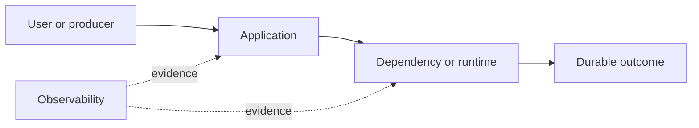

# Drill: Inference Latency Regression

> **Difficulty:** Advanced  
> **Focus:** Model serving, batching, queueing  
> **Rule:** Investigate before opening [solution.md](solution.md).

## Context

A text-generation endpoint’s time to first token doubles after a model-server configuration rollout; token throughput after the first token remains stable.

This is a synthetic exercise. Names, addresses, IDs, and values are fictional.

## Learner role

You are ML serving on-call. Model quality owners control weight changes; platform owners control accelerator scheduling.

## Symptoms

- Time to first token rises while inter-token latency is stable
- GPU utilization is high but not saturated
- Queue wait dominates traces

## Available evidence

The snapshots are intentionally incomplete. Ask what each signal proves and what it cannot prove.

### Logs

```text
20:10:01 scheduler INFO batch_wait_ms=200 max_batch=64 queued=51
20:10:01 inference INFO request=i-91 queue_ms=418 prefill_ms=72 decode_ms=904 tokens=118
20:10:02 gateway WARN first_token_deadline exceeded request=i-92 elapsed_ms=1000
20:10:03 inference INFO model_digest=sha256:aa7 scheduler_revision=19
```

### Metrics

| Signal | Incident | Baseline |
|---|---:|---:|
| `time_to_first_token_p95` | 1.42 s | 620 ms |
| `inter_token_latency_p95` | 34 ms | 33 ms |
| `scheduler_queue_p95` | 710 ms | 120 ms |
| `gpu_utilization` | 76% | 73% |

### System map



## Timeline

| Time (UTC) | Event |
|---|---|
| 19:55 | Scheduler revision 19 rollout starts |
| 20:02 | Batch wait changes from 20 ms to 200 ms |
| 20:10 | First-token SLO alert fires |
| 20:14 | Generation throughput remains steady |

## Investigation tasks

1. Decompose latency into queue, prefill, and decode.
2. Segment by prompt length, model digest, server revision, and accelerator.
3. Distinguish batching policy from model or GPU regression.
4. Choose a latency-versus-throughput mitigation.
5. Verify both SLO and capacity after change.

Record work as evidence, not conclusions:

| Hypothesis | Supporting evidence | Contradicting evidence | Discriminating test | Result |
|---|---|---|---|---|
|  |  |  |  |  |

## Decision points

- Rollback scheduler settings or add replicas?
- Reduce batch wait globally or by priority class?
- What throughput loss is acceptable to restore first-token SLO?

For every choice, state blast radius, reversibility, expected signal, owner, and rollback trigger.

## Mitigation and recovery

Expected mitigation direction: Restore the prior batch-wait configuration for interactive traffic, canary it on one server, and preserve a separate throughput-optimized class for offline requests.

Recovery must be proved, not inferred from one green check:

- First-token latency returns within SLO by prompt cohort
- Queue wait is bounded
- Inter-token latency and error rate remain healthy
- Required throughput and cost guardrails hold

## Prevention

Propose and prioritize controls in these areas:

- Track stage-level inference latency
- Canary scheduler configuration with interactive traffic
- Separate latency and throughput classes
- Replay representative prompt-length distributions

Each action needs an owner, measurable acceptance criterion, and review date.

## Debrief

1. Which observation most changed your hypothesis ranking?
2. Which action was safest under uncertainty, and why?
3. What evidence did you nearly destroy during mitigation?
4. Which alert detected impact, and which signal would detect the cause sooner?
5. What would make this drill harder without making it ambiguous?

## Authoritative sources

- [NVIDIA Triton dynamic batching](https://docs.nvidia.com/deeplearning/triton-inference-server/user-guide/docs/user_guide/batcher.html)
- [Google SRE latency](https://sre.google/sre-book/monitoring-distributed-systems/)
- [OpenTelemetry traces](https://opentelemetry.io/docs/concepts/signals/traces/)
