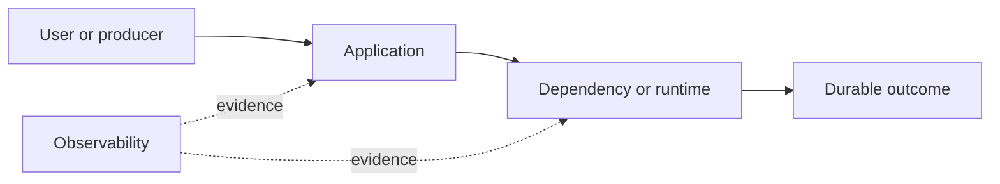

# Drill: GPU Out of Memory

> **Difficulty:** Advanced  
> **Focus:** Accelerator memory, fragmentation, workload shape  
> **Rule:** Investigate before opening [solution.md](solution.md).

## Context

One model-serving worker fails on long-context requests with CUDA out-of-memory errors. Other workers continue serving short prompts.

This is a synthetic exercise. Names, addresses, IDs, and values are fictional.

## Learner role

You are accelerator-serving on-call. You may drain workers and change request admission; model changes require owner review.

## Symptoms

- CUDA allocation fails during attention prefill
- GPU memory is near capacity
- Failures correlate with prompt length and concurrent sequences

## Available evidence

The snapshots are intentionally incomplete. Ask what each signal proves and what it cannot prove.

### Logs

```text
04:44:02 worker INFO prompt_tokens=28672 active_sequences=8
04:44:02 cuda ERROR out of memory. Tried to allocate 2.00 GiB; 1.14 GiB free
04:44:02 worker ERROR prefill failed request=g-771 device=GPU-2
04:44:03 scheduler WARN worker=GPU-2 unhealthy inflight=8
```

### Metrics

| Signal | Incident | Baseline |
|---|---:|---:|
| `gpu_memory_used` | 78.7 GiB | 61 GiB |
| `gpu_memory_total` | 80 GiB | 80 GiB |
| `active_sequences` | 8 | 4 |
| `prompt_tokens_p99` | 29k | 8k |

### System map



## Timeline

| Time (UTC) | Event |
|---|---|
| 04:30 | Long-context limit raised to 32k |
| 04:40 | Eight long requests co-scheduled |
| 04:44 | Two GiB allocation fails |
| 04:45 | Worker marked unhealthy |

## Investigation tasks

1. Correlate allocation failure with device, prompt length, batch size, and memory consumers.
2. Separate capacity exhaustion, leak, fragmentation, and hardware fault.
3. Estimate safe admission limits.
4. Recover the worker without duplicating requests.
5. Validate long-context behavior under concurrency.

Record work as evidence, not conclusions:

| Hypothesis | Supporting evidence | Contradicting evidence | Discriminating test | Result |
|---|---|---|---|---|
|  |  |  |  |  |

## Decision points

- Reduce context, concurrency, or precision?
- Drain and restart the worker now?
- How should in-flight generation outcomes be reconciled?

For every choice, state blast radius, reversibility, expected signal, owner, and rollback trigger.

## Mitigation and recovery

Expected mitigation direction: Stop admitting work to the affected worker, reconcile in-flight request IDs, then restart it cleanly. Temporarily cap long-context concurrency based on measured peak memory.

Recovery must be proved, not inferred from one green check:

- Worker rejoins with expected baseline memory
- No duplicate or lost request outcomes
- Bounded long-context load completes without allocation failure
- Memory remains stable across repeated cycles

## Prevention

Propose and prioritize controls in these areas:

- Admission-control by estimated token memory
- Load-test context and concurrency combinations
- Track allocated, reserved, and non-framework GPU memory
- Use workload-aware scheduling and explicit limits

Each action needs an owner, measurable acceptance criterion, and review date.

## Debrief

1. Which observation most changed your hypothesis ranking?
2. Which action was safest under uncertainty, and why?
3. What evidence did you nearly destroy during mitigation?
4. Which alert detected impact, and which signal would detect the cause sooner?
5. What would make this drill harder without making it ambiguous?

## Authoritative sources

- [NVIDIA CUDA memory management](https://docs.nvidia.com/cuda/cuda-runtime-api/group__CUDART__MEMORY.html)
- [PyTorch CUDA memory management](https://docs.pytorch.org/docs/stable/notes/cuda.html#cuda-memory-management)
- [NVIDIA GPU memory errors](https://docs.nvidia.com/deploy/xid-errors/index.html)
