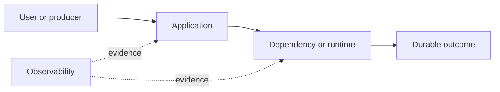

# Drill: Queue Overload

> **Difficulty:** Advanced  
> **Focus:** Backlog, consumer capacity, age-based SLOs  
> **Rule:** Investigate before opening [solution.md](solution.md).

## Context

An order-events queue grows rapidly during a promotion. Producers succeed, but fulfillment updates arrive hours late.

This is a synthetic exercise. Names, addresses, IDs, and values are fictional.

## Learner role

You are event-platform incident commander. Producer, broker, and consumer owners are available; dropping orders is prohibited.

## Symptoms

- Queue depth and oldest-message age rise
- Broker health is normal
- Consumer throughput plateaus below ingress

## Available evidence

The snapshots are intentionally incomplete. Ask what each signal proves and what it cannot prove.

### Logs

```text
13:00:01 producer INFO published order=o-881 partition=17
13:00:02 consumer WARN downstream rate_limited status=429 retry_after=2
13:00:04 consumer INFO batch=100 processed=62 retried=38 duration_ms=4010
13:01:00 broker INFO under_replicated_partitions=0 offline_partitions=0
```

### Metrics

| Signal | Incident | Baseline |
|---|---:|---:|
| `queue_ingress` | 18k/s | 7k/s |
| `queue_egress` | 9k/s | 7k/s |
| `oldest_message_age` | 42 min | 8 s |
| `consumer_retry_rate` | 38% | 1% |

### System map



## Timeline

| Time (UTC) | Event |
|---|---|
| 12:45 | Promotion begins |
| 12:50 | Ingress exceeds sustainable egress |
| 13:00 | Downstream starts rate limiting |
| 13:12 | Oldest-message SLO breaches |

## Investigation tasks

1. Quantify arrival, service, retry, and backlog growth rates.
2. Check broker partitions, consumer lag distribution, poison messages, and downstream limits.
3. Estimate drain behavior under proposed capacity.
4. Prioritize without violating ordering or correctness.
5. Prove backlog and age recovery.

Record work as evidence, not conclusions:

| Hypothesis | Supporting evidence | Contradicting evidence | Discriminating test | Result |
|---|---|---|---|---|
|  |  |  |  |  |

## Decision points

- Throttle producers, scale consumers, or negotiate downstream quota?
- Can message classes be isolated safely?
- When does replay create duplicate side effects?

For every choice, state blast radius, reversibility, expected signal, owner, and rollback trigger.

## Mitigation and recovery

Expected mitigation direction: Apply admission controls to nonessential producers, honor downstream rate limits, isolate priority classes where ordering permits, and raise consumer capacity only to a measured downstream-safe rate.

Recovery must be proved, not inferred from one green check:

- Ingress remains below sustainable successful egress
- Oldest-message age and depth decline predictably
- Retry and dead-letter rates normalize
- Sampled orders have exactly-once business outcomes

## Prevention

Propose and prioritize controls in these areas:

- Capacity-plan from arrival and service distributions
- Alert on oldest age and growth rate, not depth alone
- Use idempotent consumers and bounded retries
- Isolate workload classes and document shedding policy

Each action needs an owner, measurable acceptance criterion, and review date.

## Debrief

1. Which observation most changed your hypothesis ranking?
2. Which action was safest under uncertainty, and why?
3. What evidence did you nearly destroy during mitigation?
4. Which alert detected impact, and which signal would detect the cause sooner?
5. What would make this drill harder without making it ambiguous?

## Authoritative sources

- [Apache Kafka monitoring](https://kafka.apache.org/documentation/#monitoring)
- [RabbitMQ queue length](https://www.rabbitmq.com/docs/queues#queue-length)
- [Google SRE handling overload](https://sre.google/sre-book/handling-overload/)
