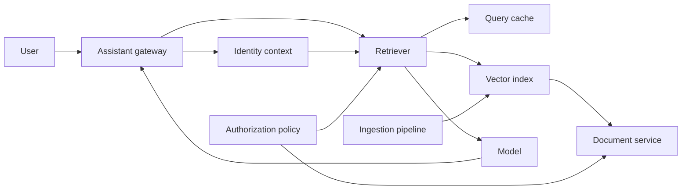

# Drill 13: RAG Corpus Poisoning or ACL Bypass

> **Difficulty:** Expert  
> **Focus:** Retrieval authorization, corpus integrity, provenance, containment  
> **Rule:** Investigate before opening [solution.md](solution.md).

## Context

A multi-tenant support assistant retrieves passages from customer runbooks. Users
in tenant `acme-demo` report answers that quote an unreleased project belonging
to another tenant. At the same time, the ingestion scanner reports a suspicious
document containing prompt-like instructions. The incident could be poisoned
content, an authorization failure, or both.

All identifiers, logs, and values are synthetic. Do not use real customer
content in the drill.

## Learner role and constraints

You are incident commander for the retrieval platform. Security, identity,
indexing, and application owners are available.

- Stop cross-tenant disclosure immediately.
- Preserve retrieval, access-decision, and ingestion evidence.
- Do not delete the corpus or rebuild every index until scope is known.
- Do not place document text, embeddings, or user prompts in the incident chat.

## Symptoms

- Three answers contain phrases absent from the requesting tenant's corpus.
- Citations point to an opaque chunk ID; the UI does not display tenant
  ownership.
- Generation safety filters pass the responses.
- A newly indexed file contains instructions to ignore system policy.
- Direct access to the cited source through the document service returns
  `403`.

## Available evidence

Evidence is intentionally incomplete. Values in angle brackets are facilitator
placeholders to replace for a live exercise.

### Application and retrieval logs

```text
2026-08-23T09:14:31.552Z assistant INFO request_id=req-7f2 tenant_id=acme-demo principal_id=user-184 policy_revision=acl-2026-08-18
2026-08-23T09:14:31.601Z retriever INFO request_id=req-7f2 index=runbooks-prod filter_hash=f98c top_k=8 cache_hit=true result_chunks=[chk-91d,chk-a40,chk-b17]
2026-08-23T09:14:31.604Z authz INFO request_id=req-7f2 decision=allow resource_count=8 evaluator=retrieval-batch-v4 decision_id=dec-55a
2026-08-23T09:14:32.219Z assistant INFO request_id=req-7f2 cited_chunks=[chk-91d,chk-a40] output_guard=pass
2026-08-23T09:16:04.109Z documents WARN request_id=req-source-12 principal_id=user-184 resource_id=doc-nova-7 decision=deny reason=tenant_mismatch
2026-08-23T09:20:18.441Z ingestion WARN document_id=doc-acme-44 tenant_id=acme-demo scanner=instruction-pattern severity=high quarantine=false
```

### Point-in-time lookups

```text
chunk_id=chk-91d document_id=doc-nova-7 metadata.tenant_id=nova-labs index_generation=gen-884
chunk_id=chk-a40 document_id=doc-acme-44 metadata.tenant_id=acme-demo index_generation=gen-884
request_id=req-7f2 requested_filter={"tenant_id":"acme-demo","classification":{"$lte":"internal"}}
cache_entry=f98c stored_filter={"classification":{"$lte":"internal"}} created_at=2026-08-23T08:58:02Z
```

### Metrics

| Signal | Incident | Baseline |
|---|---:|---:|
| `retrieval_cross_tenant_chunk_total` | `<27 in 18 min>` | `0` |
| `retrieval_cache_hit_ratio` | `91%` | `38%` |
| `document_service_acl_denied_total` | `<normal range>` | `<normal range>` |
| `ingestion_instruction_flag_total` | `1` | `0 to 3/day` |
| `assistant_citation_owner_mismatch_ratio` | `2.8%` | `0%` |

### System map



## Timeline

| Time (UTC) | Event |
|---|---|
| 08:40 | Retriever cache optimization reaches 100 percent |
| 08:58 | Cache entry `f98c` is created |
| 09:03 | Suspicious document `doc-acme-44` is indexed without quarantine |
| 09:14 | First known answer cites `chk-91d` |
| 09:16 | User cannot open the cited source |
| 09:18 | Customer report reaches support |
| 09:20 | Security and platform incident declared |

## Investigation tasks

1. Establish affected tenants, principals, requests, index generations, and
   time range without copying exposed content.
2. Trace one citation from response to chunk, document owner, retrieval filter,
   cache entry, authorization decision, and source read.
3. Test whether the suspicious document can influence generation without
   explaining the cross-tenant retrieval.
4. Compare cache hits and misses, policy revisions, and index generations.
5. Determine whether exposure occurred in retrieval only or in logs, caches,
   exports, and downstream traces.

Record observations separately from interpretations:

| Hypothesis | Supporting evidence | Contradicting evidence | Discriminating test | Result |
|---|---|---|---|---|
| Corpus poisoning caused disclosure |  |  |  |  |
| Retrieval ACL or filter bypass |  |  |  |  |
| Incorrect chunk ownership metadata |  |  |  |  |
| Citation rendering defect only |  |  |  |  |

## Decision points

- Disable all retrieval, bypass the query cache, or isolate only affected index
  generations?
- Quarantine one suspicious document before proving whether it caused the
  disclosure?
- Notify all tenants immediately or first bound recipients and exposed
  resources?
- Can a cached result ever be reused across principals or tenants, even if an
  authorization decision follows retrieval?
- Which evidence must be retained before cache eviction or index rollback?

For each choice, state owner, blast radius, expected causal signal,
reversibility, rollback trigger, and maximum observation window.

## Bounded mitigation and recovery

The safe initial direction is to disable shared retrieval-result cache reads,
force tenant and principal-aware authorization on every returned chunk, and
block responses when citation ownership cannot be proven. Apply this at the
retrieval tier before considering a corpus-wide rebuild. Quarantine the flagged
document as a separate reversible containment action.

Stop expansion if latency exceeds `<retrieval latency ceiling>`, error rate
exceeds `<error budget threshold>`, or any canary returns a chunk owned by
another tenant. Do not restore caching until cache-key and post-retrieval
authorization tests pass.

Recovery requires all of the following:

- Synthetic cross-tenant probes return no unauthorized chunks.
- Every returned chunk has an allow decision bound to principal, tenant,
  resource, policy revision, and request.
- Known affected requests and recipients are enumerated from immutable audit
  data.
- Poison-content probes are contained independently of ACL probes.
- User-visible citations resolve only to documents the user can open.

## Prevention work

Propose controls with owners and objective acceptance evidence:

- Authorization before and after retrieval, with deny on missing metadata.
- Cache keys bound to security context, policy revision, index generation, and
  normalized filter.
- Signed provenance from source document through chunk and citation.
- Ingestion quarantine for untrusted active instructions and malformed ACL
  metadata.
- Cross-tenant negative tests in CI and continuous production canaries.
- Privacy-preserving audit logs with defined retention and incident query
  procedures.

## Debrief

1. Which evidence distinguishes hostile content from unauthorized retrieval?
2. Which mitigation reduced disclosure while preserving the most evidence?
3. Did any safety layer create false confidence because it operated after
   retrieval?
4. Could the team identify every recipient without reading sensitive content?
5. Which control would have prevented the incident, and which would only have
   detected it sooner?

## Authoritative sources

- [NIST AI Risk Management Framework Generative AI Profile](https://nvlpubs.nist.gov/nistpubs/ai/NIST.AI.600-1.pdf)
- [OWASP Top 10 for LLM Applications: Vector and Embedding Weaknesses](https://genai.owasp.org/llmrisk/llm08-vector-and-embedding-weaknesses/)
- [OWASP Authorization Cheat Sheet](https://cheatsheetseries.owasp.org/cheatsheets/Authorization_Cheat_Sheet.html)
- [NIST SP 800-53 Rev. 5, Access Control and Audit controls](https://csrc.nist.gov/pubs/sp/800/53/r5/upd1/final)
