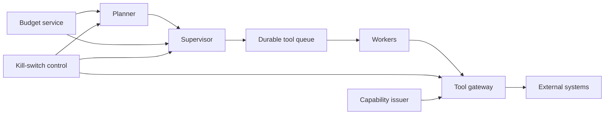

# Drill 14: Agent Runaway, Tool Budget Exhaustion, and Kill-Switch Latency

> **Difficulty:** Expert  
> **Focus:** Agent control planes, idempotency, budgets, emergency stop  
> **Rule:** Investigate before opening [solution.md](solution.md).

## Context

An autonomous customer-operations agent begins repeatedly invoking ticket,
email, and CRM tools after a workflow release. Spend and queue depth rise.
Operators press the global stop control, but tool calls continue for several
minutes. Some calls have external side effects.

All accounts, request IDs, logs, and values are synthetic. Tool endpoints in
this drill must be simulators.

## Learner role and constraints

You are incident commander. Agent runtime, tool gateway, identity, and business
operations owners are available.

- Prevent additional external side effects.
- Preserve enough state to distinguish queued, running, retried, and completed
  actions.
- Do not revoke unrelated production identities or purge durable queues.
- Assume tool responses can be delayed and clients can retry after timeout.

## Symptoms

- Tool invocations increase from 40 per minute to 2,900 per minute.
- Per-run tool budgets appear exhausted, but new child runs continue.
- Duplicate emails and ticket comments are reported.
- The control plane says `STOPPED`; gateway accepts calls bearing already
  issued capability tokens.
- Queue consumers continue processing after the operator stop.

## Available evidence

Values in angle brackets are facilitator placeholders for a live environment.

### Runtime, gateway, and control logs

```text
2026-08-23T11:02:08.114Z planner INFO run_id=run-813 parent_run_id=run-701 action=spawn_child reason=verify_completion depth=6
2026-08-23T11:02:08.119Z budget WARN run_id=run-813 tool_calls_used=50 tool_calls_limit=50 action=deny
2026-08-23T11:02:08.126Z supervisor INFO run_id=run-701 child_run_id=run-814 inherited_budget=false
2026-08-23T11:03:44.802Z tool-gateway WARN invocation_id=inv-992 tool=email.send deadline_exceeded retryable=true idempotency_key=missing
2026-08-23T11:03:45.011Z worker INFO run_id=run-814 retry=1 invocation_id=inv-993 tool=email.send
2026-08-23T11:05:00.000Z control INFO scope=global generation=44 desired_state=stopped actor=operator-12
2026-08-23T11:05:00.043Z runtime INFO scope=global observed_generation=44 state=stopped
2026-08-23T11:08:51.427Z tool-gateway INFO invocation_id=inv-a02 token_generation=43 tool=crm.comment auth=allow status=201
2026-08-23T11:09:58.220Z worker INFO queue=agent-tools lease_started=2026-08-23T11:04:59Z control_check=at_dequeue
```

### Metrics

| Signal | Incident | Baseline |
|---|---:|---:|
| `agent_active_runs` | `18,420` | `310` |
| `agent_child_runs_created_rate` | `1,100/min` | `12/min` |
| `tool_gateway_requests_rate` | `2,900/min` | `40/min` |
| `tool_side_effect_duplicate_total` | `<143>` | `0` |
| `tool_queue_oldest_age` | `7m 12s` | `<5s` |
| `killswitch_effective_latency_p99` | `4m 58s` | `<10s target>` |
| `capability_token_ttl` | `10m` | `10m` |
| `agent_cost_rate` | `<currency 1,900/hour>` | `<currency 80/hour>` |

### System map



## Timeline

| Time (UTC) | Event |
|---|---|
| 10:48 | Workflow revision `wf-209` reaches 100 percent |
| 11:01 | Child-run creation and cost alerts fire |
| 11:03 | First duplicate side effect is reported |
| 11:05 | Operator activates global stop generation 44 |
| 11:05 | Runtime reports stopped |
| 11:08 | Gateway accepts generation 43 capability |
| 11:10 | Side-effect rate finally reaches zero |

## Investigation tasks

1. Bound active runs, child lineage, queued work, in-flight calls, external side
   effects, and cost exposure.
2. Determine whether budget limits are global, per root run, per child, or per
   worker attempt.
3. Trace stop generation propagation through planner, supervisor, queue,
   worker, gateway, and external system.
4. Separate duplicate effects caused by model looping from retries without
   idempotency.
5. Measure kill-switch latency from operator acknowledgment to the last newly
   authorized side effect, not merely runtime status.

| Hypothesis | Supporting evidence | Contradicting evidence | Discriminating test | Result |
|---|---|---|---|---|
| Planner loop alone |  |  |  |  |
| Budget bypass through child runs |  |  |  |  |
| Queue drain after stop |  |  |  |  |
| Gateway accepts stale capability |  |  |  |  |
| Client timeout creates duplicate effects |  |  |  |  |

## Decision points

- Revoke agent capabilities at the gateway, pause consumers, or stop planners
  first?
- Cancel queued actions when completion state is uncertain?
- Retry timed-out side effects or reconcile externally before any retry?
- Use a global stop or isolate workflow revision `wf-209`?
- What maximum kill-switch latency is acceptable for each tool risk class?

For each action, declare scope, owner, expected signal, rollback trigger, and
how already in-flight effects will be reconciled.

## Bounded mitigation and recovery

The preferred sequence is to deny new side-effecting calls at the tool gateway
for the affected workflow and stale control generations, stop child creation,
and pause affected queue consumers without deleting messages. Keep read-only
diagnostic tools available through a separate identity.

Do not retry ambiguous timeouts until the external system is queried by stable
idempotency key or business operation ID. Roll back the workflow only after new
effects are blocked.

Recovery requires:

- No newly authorized side effect after the declared cutoff.
- Root-run budgets include all descendants and retry attempts.
- Queue states are reconciled into safe-to-run, completed, ambiguous, and
  canceled sets.
- Duplicate effects are identified and remediated through business-approved
  procedures.
- Kill-switch latency is measured at planner, queue, gateway, and external
  effect boundaries.
- Cost rate and active lineage count remain within guardrails for a full
  workflow cycle.

## Prevention work

- Root-scoped budgets for tokens, wall time, child count, tool calls, retries,
  money, and side-effect risk.
- Gateway enforcement of control generation on every invocation.
- Short-lived, attenuated capabilities bound to run, tool, arguments, and risk
  class.
- Required idempotency keys and external reconciliation for side-effecting
  tools.
- Bounded recursion, fan-out, and retry policies enforced outside the model.
- Regular kill-switch tests that measure effective stop latency.

Each item needs an owner, an objective acceptance test, and a review date.

## Debrief

1. Which signal falsely suggested that the incident was contained?
2. Where was the final enforceable boundary before external side effects?
3. Did cost, call count, and side-effect budgets share the same root scope?
4. Which actions were unsafe to replay, and how was ambiguity resolved?
5. Could operators stop harmful writes while retaining read-only diagnosis?

## Authoritative sources

- [NIST AI RMF Generative AI Profile](https://nvlpubs.nist.gov/nistpubs/ai/NIST.AI.600-1.pdf)
- [Google SRE, Handling Overload](https://sre.google/sre-book/handling-overload/)
- [AWS Builders' Library, Making retries safe with idempotent APIs](https://aws.amazon.com/builders-library/making-retries-safe-with-idempotent-APIs/)
- [NIST SP 800-207, Zero Trust Architecture](https://csrc.nist.gov/pubs/sp/800/207/final)
