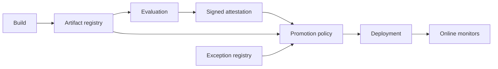

# Drill 15: Stale Evaluation Promotion and Artifact Digest Drift

> **Difficulty:** Expert  
> **Focus:** Model supply chain, immutable identity, policy enforcement, rollback  
> **Rule:** Investigate before opening [solution.md](solution.md).

## Context

A model release passes the deployment gate and reaches 35 percent of production.
Safety refusals then regress and a regulated-language slice exceeds its quality
threshold. The release dashboard links to a green evaluation report, but the
artifact digest running in production differs from the digest recorded by the
evaluation job.

All models, registries, test data, and values are synthetic.

## Learner role and constraints

You are release incident commander. Model quality, safety, registry, deployment,
and policy owners are available.

- Halt unsafe expansion without destroying release evidence.
- Do not rerun evaluation and treat the new result as proof of what was
  originally promoted.
- Preserve artifact, attestation, policy input, decision, and deployment
  identities.
- Roll back by immutable digest, not a mutable tag.

## Symptoms

- Safety refusal pass rate falls only on the new production cohort.
- The release UI shows all required evaluations green.
- Production serves digest `sha256:9c4...`; the evaluation attestation names
  `sha256:3ab...`.
- Both artifacts have tag `support-model:2026-08-23`.
- Policy logs contain a failed digest-binding check followed by an advisory
  decision.

## Available evidence

Values in angle brackets are facilitator placeholders for a live exercise.

### Evaluation, registry, policy, and deployment logs

```text
2026-08-23T06:12:42.003Z evaluator INFO eval_id=eval-442 artifact_digest=sha256:3ab suite_digest=sha256:e71 result=pass report_uri=attestations/eval-442
2026-08-23T06:18:09.771Z registry INFO repository=support-model tag=2026-08-23 digest=sha256:3ab action=tag
2026-08-23T06:31:55.218Z registry WARN repository=support-model tag=2026-08-23 old_digest=sha256:3ab new_digest=sha256:9c4 action=retag actor=build-bot
2026-08-23T06:36:01.104Z policy ERROR release_id=rel-881 rule=evaluation.subject_digest_matches actual=false error=attestation_subject_mismatch
2026-08-23T06:36:01.105Z policy WARN release_id=rel-881 enforcement=advisory outcome=allow reason=migration_exception exception_id=exc-17
2026-08-23T06:36:08.990Z deploy INFO release_id=rel-881 requested_ref=support-model:2026-08-23 resolved_digest=sha256:9c4 cohort=5%
2026-08-23T06:48:14.040Z deploy INFO release_id=rel-881 resolved_digest=sha256:9c4 cohort=35%
```

### Artifact and attestation snapshot

```text
eval-442.subject.digest=sha256:3ab
eval-442.suite.digest=sha256:e71
eval-442.policy_bundle.digest=sha256:5d2
rel-881.deployed.digest=sha256:9c4
exc-17.scope=all-model-releases
exc-17.expires_at=2026-08-30T00:00:00Z
sha256:3ab.parent_checkpoint=base-41
sha256:9c4.parent_checkpoint=base-41
sha256:9c4.build_reason=tokenizer-packaging-fix
```

### Metrics

| Signal | New cohort | Control or threshold |
|---|---:|---:|
| `safety_refusal_pass_rate` | `91.2%` | `>=99.5%` |
| `regulated_language_quality_pass_rate` | `94.1%` | `>=98.0%` |
| `model_server_error_rate` | `0.3%` | `<1.0%` |
| `artifact_eval_digest_match` | `0` | `1` |
| `policy_fail_open_total` | `1` | `0` |
| `release_cohort_percent` | `35%` | `<next step: 60%>` |

### System map



## Timeline

| Time (UTC) | Event |
|---|---|
| 06:12 | Digest `3ab` passes evaluation suite `e71` |
| 06:18 | Release tag points to digest `3ab` |
| 06:31 | Build automation moves the tag to digest `9c4` |
| 06:36 | Digest-binding policy errors and migration exception allows promotion |
| 06:48 | Release reaches 35 percent |
| 06:51 | Safety and regulated-slice alerts fire |
| 06:55 | Release incident declared |

## Investigation tasks

1. Identify the exact digest, configuration, tokenizer, policy bundle,
   evaluation suite, and data snapshot for the evaluated and deployed subjects.
2. Verify attestation signatures and subject bindings without relying on the
   release UI's derived status.
3. Determine whether the policy engine denied, failed open, or applied a valid
   scoped exception.
4. Compare new cohort against an immutable known-good digest and segment impact
   by safety and quality slice.
5. Bound all endpoints, regions, batch jobs, and caches that resolved the
   mutable tag.

| Hypothesis | Supporting evidence | Contradicting evidence | Discriminating test | Result |
|---|---|---|---|---|
| Evaluated model regressed in production |  |  |  |  |
| Mutable tag changed after evaluation |  |  |  |  |
| Evaluation data or policy was stale |  |  |  |  |
| Policy engine failed open |  |  |  |  |
| Monitoring slice is invalid |  |  |  |  |

## Decision points

- Freeze expansion, roll back immediately, or run an emergency evaluation?
- Roll back to a tag or a previously verified digest?
- Can a packaging-only rebuild inherit an earlier model evaluation?
- Is exception `exc-17` valid when it covers all releases and the binding rule
  failed?
- Which artifact and decision evidence must be preserved before remediation?

For every action, state the exact digest, blast radius, owner, expected signal,
rollback trigger, and observation interval.

## Bounded mitigation and recovery

Freeze rollout and tag mutation immediately. Route the new cohort back to the
last known-good immutable digest, first as a narrow routing change and then
expand if safety, quality, and service-health guardrails recover. Block any
promotion whose attestation subject differs from the resolved deployment
digest. Do not certify digest `9c4` during incident response by merely linking
the old report.

Recovery requires:

- Every serving process reports the intended known-good digest.
- Safety and regulated-language slices recover against a stable control.
- Registry, evaluation, policy, and deployment records join by immutable
  digest.
- No release remains authorized only by the broad migration exception.
- Caches and batch systems that resolved the mutable tag are inventoried and
  corrected.

## Prevention work

- Digest-pinned evaluation, promotion, deployment, rollback, and observability.
- Signed attestations binding artifact, suite, data snapshot, configuration,
  and policy bundle.
- Fail-closed subject mismatch and narrowly scoped, expiring, approved
  exceptions.
- Registry controls that prohibit release-tag mutation.
- Independent canary gates for safety, quality slices, and operational health.
- Periodic reconciliation of evaluated, approved, and running digests.

## Debrief

1. At what point did a green status stop referring to the deployed artifact?
2. Which system owned the invariant that evaluated digest equals deployed
   digest?
3. Why is an emergency rerun insufficient evidence about the original
   promotion decision?
4. Did rollback identify a digest or merely another mutable name?
5. What should happen when policy evaluation itself errors?

## Authoritative sources

- [SLSA specification, Provenance](https://slsa.dev/spec/v1.0/provenance)
- [in-toto Attestation Framework](https://github.com/in-toto/attestation/blob/main/spec/README.md)
- [NIST AI RMF Generative AI Profile](https://nvlpubs.nist.gov/nistpubs/ai/NIST.AI.600-1.pdf)
- [NIST Secure Software Development Framework](https://csrc.nist.gov/pubs/sp/800/218/final)
