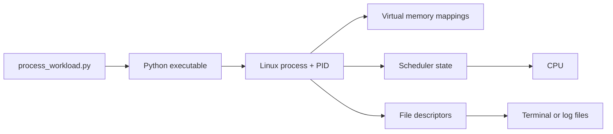

# Lab: Make a Python Process Visible

This lab turns **Source → Runtime/Compiler → OS → Process → Memory → CPU → Output** into evidence you can inspect.

You will start one safe, bounded Python program, inspect only that process, break one assumption, and explain what you observed. No prior Linux administration experience is required.

## What You Will Prove

By the end, you can show that:

1. a Python source file, the Python executable, and a running process are different;
2. a process has an identity, parent, state, memory mappings, and open file descriptors;
3. mapped virtual memory and resident physical memory are not the same measurement;
4. a process can be alive while waiting instead of using the CPU;
5. output follows file descriptor routes and can be buffered;
6. each claim needs evidence—and each piece of evidence has limits.



## Safety Contract

The supplied workload:

- runs for at most 10 minutes;
- allocates at most 256 MiB;
- performs no network or privileged operations;
- handles normal termination signals;
- keeps its allocated memory alive only for inspection.

The inspector refuses to inspect a process owned by another user. Use only the PID saved by this lab. Do not search for processes by name and kill them.

## Before You Start

### Required environment

- Linux with `/proc` mounted
- Bash 4+
- Python 3.9+
- `ps`, `readlink`, `stat`, `sed`, and `tr`
- two terminal windows or tabs opened in this repository

On macOS or Windows, run both terminals inside the **same Linux VM or container**. Docker Desktop users must enter the same running container in both terminals; a new container has a different process namespace.

### Files you will use

- [`process_workload.py`](./process_workload.py) — safe workload with memory, CPU work, sleep, stdout, and stderr
- [`inspect_process.sh`](./inspect_process.sh) — read-only report for one same-user PID

### Checkpoint 0 — confirm the lab can run

From the repository root:

```bash
cd labs/01-software-execution
python3 --version
test -r /proc/self/status && echo "/proc is readable"
python3 -m py_compile process_workload.py
bash -n inspect_process.sh
```

**Success looks like:** a Python version, `/proc is readable`, and no error from the final two commands.

If `./inspect_process.sh` is not executable, use `bash inspect_process.sh` throughout. The compile check may create `__pycache__`; cleanup removes it.

## Beginner Path

Complete this path before exploring extra fields.

### Step 1 — predict

Write one sentence for each:

1. Will Linux load `process_workload.py` as the executable, or load Python?
2. Will the process usually be running or sleeping when you inspect it?
3. Will virtual size (VSZ) or resident size (RSS) be larger?
4. Where will file descriptors `1` and `2` point after output is redirected?
5. Does the CPU execute Python source, Python bytecode, or native CPython instructions?

Wrong predictions are useful. Keep them unchanged until the reflection.

### Step 2 — start one workload in terminal A

```bash
cd labs/01-software-execution
python3 process_workload.py --seconds 120 --memory-mib 32 \
  >workload.stdout.log 2>workload.stderr.log &
LAB_PID=$!
printf 'LAB_PID=%s\n' "$LAB_PID"
printf '%s\n' "$LAB_PID" > .lab-pid
```

What happened:

- `python3` is the executable requested by the shell;
- the `.py` path is an argument consumed by Python;
- `&` leaves the process running in the background;
- `$!` is the PID of that background process;
- `>` routes stdout to one file; `2>` routes stderr to another.

Confirm it still exists:

```bash
kill -0 "$LAB_PID" && echo "process exists and is signalable"
```

`kill -0` sends no signal. It checks existence and permission.

**Checkpoint 1:** You have one numeric PID, `.lab-pid` contains it, and the command prints the confirmation.

### Step 3 — inspect the exact PID in terminal B

```bash
cd labs/01-software-execution
LAB_PID=$(<.lab-pid)
./inspect_process.sh "$LAB_PID" | tee inspection.txt
```

If the script is not executable:

```bash
bash inspect_process.sh "$LAB_PID" | tee inspection.txt
```

Do not try to understand every line yet. Find these six observations:

| Find in the report | Meaning for now |
|---|---|
| `pid` / `Pid` | Identity of this running instance |
| `ppid` / `PPid` | Identity of the process that started it |
| `exe:` | Executable Linux loaded |
| `cmdline:` | Executable plus source path and arguments |
| `VmSize` and `VmRSS` | Mapped address space vs currently resident pages |
| `1 ->` and `2 ->` | Destinations of stdout and stderr |

**Checkpoint 2:** The PID agrees across the report, `exe:` names Python, `cmdline:` includes `process_workload.py`, and descriptors `1` and `2` point to the two log files.

### Step 4 — prove source is not the executable

```bash
readlink "/proc/$LAB_PID/exe"
tr '\0' ' ' <"/proc/$LAB_PID/cmdline"
printf '\n'
```

Expected pattern:

- `exe` resolves to a Python binary;
- `cmdline` includes both Python and `process_workload.py`.

**What this proves:** Linux is running the native Python executable, which consumes the source file.

**What this does not prove:** It does not show every internal CPython compilation or interpretation step. The lesson’s `compile`/`dis` Tiny Proof supplies that evidence.

### Step 5 — prove alive does not mean using CPU

Run this twice, five seconds apart:

```bash
ps -o pid,ppid,stat,etime,time,%cpu,comm,args -p "$LAB_PID"
sleep 5
ps -o pid,ppid,stat,etime,time,%cpu,comm,args -p "$LAB_PID"
```

- `etime` is elapsed wall-clock time.
- `time` is accumulated CPU time.
- `S` usually means interruptible sleep.
- `R` means running or runnable.

The workload briefly computes, then sleeps between heartbeats. During sleep, elapsed time grows while CPU time changes little.

**Checkpoint 3:** Explain this sentence in your own words: “A process can exist for 120 seconds without consuming 120 seconds of CPU.”

### Step 6 — distinguish mapped from resident memory

```bash
ps -o pid,vsz,rss -p "$LAB_PID"
sed -n '/^VmSize:/p;/^VmRSS:/p;/^RssAnon:/p;/^RssFile:/p' \
  "/proc/$LAB_PID/status"
```

Values are usually KiB:

- **VSZ / VmSize:** total virtual address space mapped or reserved.
- **RSS / VmRSS:** estimate of pages currently present in physical memory.
- **RssAnon:** resident anonymous memory, which includes much of the touched allocation.
- **RssFile:** resident file-backed pages, such as executable or library code.

The requested 32 MiB will not equal one field exactly. Python, libraries, allocator behavior, shared pages, and accounting all contribute.

**Checkpoint 4:** VSZ is not “RAM used.” RSS is closer to current residency but is still an accounting measure with sharing caveats.

### Step 7 — follow output

```bash
for fd in 0 1 2; do
  printf 'fd %s -> ' "$fd"
  readlink "/proc/$LAB_PID/fd/$fd"
done

sed -n '1,10p' workload.stdout.log
sed -n '1,10p' workload.stderr.log
```

Conventional meanings:

- fd `0`: standard input;
- fd `1`: standard output;
- fd `2`: standard error.

The workload uses `flush=True`, so messages should appear while the process is still alive. A file descriptor is a per-process integer handle; it is not itself the file.

**Checkpoint 5:** Point to the exact evidence that stdout and stderr followed different routes.

### Step 8 — wait for a normal exit in terminal A

```bash
wait "$LAB_PID"
LAB_STATUS=$?
printf 'exit_status=%s\n' "$LAB_STATUS"
```

Normal completion returns `0`. Linux removes `/proc/$LAB_PID` after the process is reaped; the source file and Python executable remain.

If the process has already finished when you inspect it, restart Step 2. PIDs can eventually be reused, so always verify owner and command line.

## Explain the Observation

Create `evidence.md` with this table:

| Claim | Evidence | Observation | What it supports | What it does not prove |
|---|---|---|---|---|
| Python is the loaded executable | `/proc/PID/exe` | your output | runtime differs from source | internal bytecode steps |
| This is the PID I started | `$!`, `.lab-pid`, report | your output | identity agrees | useful progress |
| The process mostly waited | `stat`, `etime`, CPU `time` | your output | low CPU during sleep | why every future wait occurs |
| Mapped memory exceeds resident memory | VSZ, RSS | your output | mapping differs from residency | exact private physical ownership |
| stdout and stderr are files | `/proc/PID/fd/1`, `/fd/2` | your output | output routing | durable downstream processing |

Replace `PID` with the number you used. Add the prediction that changed most and explain why.

## Go Deeper

### Inspect memory regions

While a fresh workload is running:

```bash
sed -n '1,30p' "/proc/$LAB_PID/maps"
```

Find, if present:

- Python or a shared library ending in `.so`;
- `[heap]`;
- `[stack]`;
- a mapping with no pathname.

Permissions such as `r-xp` describe the mapping contract; they do not mean every page is resident.

### Inspect waiting and context switches

```bash
printf 'wait channel: '
tr -d '\n' <"/proc/$LAB_PID/wchan"
printf '\n'
sed -n '/^voluntary_ctxt_switches:/p;/^nonvoluntary_ctxt_switches:/p' \
  "/proc/$LAB_PID/status"
```

During `time.sleep`, a timer-related wait channel may appear, but kernel names vary and can be hidden. Treat it as one clue, not a complete scheduler trace.

## Build / Break / Debug

### Build

Copy the workload:

```bash
cp process_workload.py my_workload.py
```

Add exactly one bounded behavior:

- open one local file and keep it open;
- create one sleeping thread;
- allocate memory in four timed steps, never exceeding 128 MiB;
- print the system page size with `os.sysconf`.

Before running, predict which report field changes.

**Success criteria:** a before/after report shows the predicted observable; your explanation names the mechanism and one alternate explanation you ruled out.

### Break

Choose one:

1. `./inspect_process.sh abc` — trigger input validation.
2. Inspect the tracked PID after exit — observe the process directory disappear.
3. In a temporary copy, remove `flush=True`, redirect stdout, and compare visibility.
4. Request `--memory-mib 999` — observe bounded argument validation.

**Success criteria:** record prediction → symptom → responsible boundary → evidence → recovery. Do not edit the supplied scripts; use a copy.

### Debug

Scenario: `.lab-pid` exists, but the inspector says the process is not running.

```bash
LAB_PID=$(<.lab-pid)
printf 'recorded pid=%s\n' "$LAB_PID"
ps -o user,pid,ppid,stat,etime,comm,args -p "$LAB_PID"
sed -n '1,20p' workload.stderr.log
```

Evaluate four hypotheses:

- the bounded workload completed;
- argument validation prevented startup;
- the process received a signal;
- `.lab-pid` is stale or wrong.

Restart only after stating which evidence supports your conclusion.

## Teach It Back

Without notes, give both explanations.

### To a smart non-engineer

Explain the recipe, cook, kitchen manager, workspace, hands, and delivery route—then say what the analogy misses.

### To an engineer

Use these terms correctly: source, CPython, executable, process, PID, parent, virtual address space, resident pages, scheduler state, CPU time, file descriptor, buffer, exit status.

Your explanation passes when the listener can answer:

1. Why is the `.py` file not the loaded executable?
2. How can a process be alive but use almost no CPU?
3. Why is VSZ usually larger than RSS?
4. How can output go to a file instead of a terminal?
5. Which claim did your evidence not prove?

## Cleanup

Stop only the PID you tracked if it still exists:

```bash
if [[ -n "${LAB_PID:-}" ]] && kill -0 "$LAB_PID" 2>/dev/null; then
  kill "$LAB_PID"
  wait "$LAB_PID" || true
fi
```

Remove generated artifacts:

```bash
rm -rf __pycache__
rm -f .lab-pid inspection.txt evidence.md my_workload.py
rm -f workload.stdout.log workload.stderr.log
```

## Completion Checklist

- [ ] Environment checks pass.
- [ ] Predictions exist from before the run.
- [ ] PID, owner, executable, source argument, and parent agree.
- [ ] Evidence distinguishes process existence from CPU progress.
- [ ] Evidence distinguishes virtual mappings from resident pages.
- [ ] File descriptor evidence explains stdout and stderr destinations.
- [ ] One safe build changed a predicted observable.
- [ ] One controlled failure was diagnosed and recovered.
- [ ] Cleanup leaves no lab workload running.
- [ ] You can explain the execution chain to a non-engineer and an engineer.
- [ ] You recorded one conclusion the evidence does **not** support.

## Next

Update your evidence in [PROGRESS.md](../../PROGRESS.md), then return to [Module 00’s teaching spine](../../00-history/README.md) or continue to the [Module 02 orientation](../../02-python/README.md).
