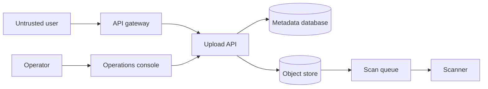

# Lab: Threat-Model a File Upload Service

Model trust boundaries and abuse paths for a fictional file upload service, prioritize threats with explicit assumptions, and verify mitigations with local test cases.

## Prerequisites

- A Markdown editor, Python 3, and Mermaid renderer
- Familiarity with HTTP, object storage, queues, and identity
- No live application or cloud account

## Safety

Use only the fictional system described here. Do not scan, exploit, or probe any real endpoint. Use inert filenames and text payloads; do not create malware samples. Treat diagrams and threat records as potentially sensitive architecture data.

## Setup and baseline

Create `.work/model.md`. The system has: browser client, API gateway, upload API, metadata database, object store, asynchronous scanner, and operations console. Users receive signed upload URLs; the scanner marks objects safe before download. Administrators use a separate identity provider.

Render this starting diagram and verify that the renderer reports no syntax errors:



## Tasks

1. Inventory assets: file confidentiality, object integrity, authorization decisions, scanner verdicts, audit trail, availability, and signing keys.
2. Mark trust boundaries, data classifications, identities, entry points, privileged operations, and external dependencies on a revised diagram.
3. Enumerate at least twelve threats across spoofing, tampering, repudiation, information disclosure, denial of service, and privilege escalation.
4. For each threat record precondition, affected asset, attack path, existing control, evidence needed, likelihood, impact, and uncertainty.
5. Prioritize using a documented ordinal matrix, not invented precision. Select the top three.
6. Specify preventive, detective, and recovery controls for each top threat. Include ownership and a testable acceptance criterion.
7. Cover signed-URL scope and expiry, content-type confusion, path/key manipulation, decompression bombs, scanner bypass, race before verdict, tenant isolation, audit integrity, and operator compromise.

## Evidence to keep

Keep system assumptions, valid Mermaid source, asset and data-flow inventory, threat register, prioritization rationale, abuse cases, selected controls, test cases, residual risks, and review date. Distinguish design claims from controls verified in implementation.

## Failure injection

Change the fictional design so downloads are permitted while scanner status is `pending`. Walk through the resulting race, identify violated invariants, and write a local policy test table that denies `pending`, `failed`, and absent verdicts. Restore the intended fail-closed rule.

## Cleanup

```bash
rm -rf .work
```

If the model is adapted to a real system, store it under that system's architecture-data policy.

## Rubric

- 2 points: complete assets, actors, flows, and trust boundaries
- 3 points: concrete threats with preconditions and evidence needs
- 2 points: defensible prioritization with uncertainty
- 2 points: layered controls and verifiable acceptance criteria
- 1 point: fail-closed scanner race is modeled and corrected

## Sources

- [NIST SP 800-154, data-centric threat modeling](https://csrc.nist.gov/pubs/sp/800/154/ipd)
- [OWASP Threat Modeling Cheat Sheet](https://cheatsheetseries.owasp.org/cheatsheets/Threat_Modeling_Cheat_Sheet.html)
- [MITRE CAPEC](https://capec.mitre.org/)
