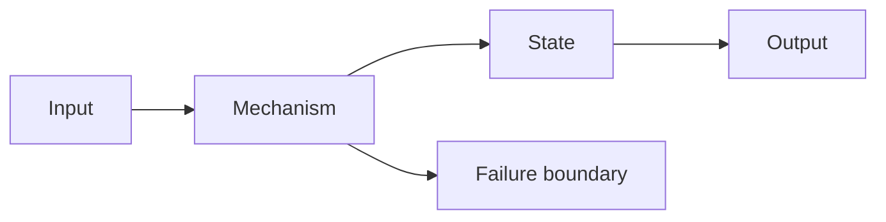

# Lesson Title

## Why You're Learning This

State the capability this unlocks and the decisions or failures that require it.

## Historical Context

Describe: Before → Problem → Innovation → New abstraction → New problems → Modern connection.

## Problem This Solves

Define the constraints, users, and failure of the previous approach.

## Mental Model

Give a compact model that predicts behavior. State where it stops being accurate.

## Core Concepts

Define the minimum concepts and their relationships.

## How It Actually Works

Trace the critical path through concrete components and state transitions.

## Deep Dive

Inspect internals, invariants, algorithms, resource costs, or protocol details.

## Visual Model

## Code / Commands

Provide a minimal, safe, reproducible example. Explain expected effects.

## Practical Example

Apply the mechanism to a realistic engineering task.

## Where This Appears in Production

Connect it to architectures, operations, and adjacent domains.

## Common Failure Modes

List symptoms, likely causes, and misleading interpretations.

## Debugging Approach

Use hypothesis → evidence → isolation → correction → prevention.

## Hands-On Lab

Link to a lab with observable completion evidence.

## Build Exercise

Build a reduced version without copying the worked example.

## Break It Exercise

Introduce a controlled fault; predict, observe, explain, recover.

## No-AI Challenge

Set a bounded task completed from primary documentation and first principles.

## Knowledge Check

Ask mechanism, tradeoff, and failure questions—not vocabulary recall alone.

## Interview Questions

Include progressive follow-ups that change constraints.

## Explain It Yourself

Provide an explain-back prompt that must be answered without notes.

## Key Takeaways

State durable principles and boundaries.

## Vocabulary

Define introduced terms and link to [GLOSSARY.md](../GLOSSARY.md).

## References

- **REQUIRED** — *Title* — Organization/author — canonical link — why it matters.
- **RECOMMENDED** — *Title* — Organization/author — canonical link — why it matters.
- **DEEP DIVE** — *Title* — Organization/author — canonical link — why it matters.

## Next Lesson

Link forward and explain the dependency.
