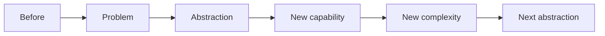

# Lesson Title

## In One Sentence

One plain sentence a beginner can understand. Use no unexplained jargon.

## Why This Exists

Name prerequisites with exact links. Describe the concrete real-world problem before the abstraction existed. A learner should understand the pressure without knowing the solution’s name.

## Picture This

Use one everyday analogy or story. Do not use the engineering term until the underlying idea is visible. State where the analogy stops being accurate.

## The Real Definition

Introduce the engineering name, then define it precisely and gently. Establish:

1. **Intuition layer** — what the idea means in plain language.
2. **Mechanism layer** — components, state, and causality.
3. **Engineering layer** — production behavior, failures, and tradeoffs.

## Mental Model

Explain how to narrate every arrow. State the model’s boundary.

## How It Actually Works

Trace the critical path step by step. Prefer “because A changed, B happens” over disconnected facts. Include internals only when they affect a decision, symptom, or tradeoff.

## Tiny Proof

Provide the smallest safe code or command demo that makes the central claim observable.

1. Ask for a prediction before execution.
2. Show the command/code.
3. State the expected observation.
4. Explain what the observation proves and what it does not prove.

## In Production

Show where this mechanism appears in real systems: Linux, cloud, Kubernetes, AI infrastructure, or another concrete environment. Connect the intuition layer to engineering consequences.

## How It Breaks

List common failures as **symptom → likely mechanism → misleading conclusion to avoid**. Include unsafe or overloaded boundaries where relevant.

## Debug It

Use:

**precise symptom → last proven boundary → falsifiable hypothesis → smallest useful evidence → controlled comparison → correction → prevention**

Name the first evidence to inspect and why.

## Build / Break Exercises

### Guided proof

Give a bounded first exercise.

### Build

Build a reduced version from a blank start.

### Break

Introduce one safe fault at a time. Predict, observe, explain, recover.

### No-AI challenge

Set a task completed from the learner’s model, local tools, and primary documentation.

For every task, state observable success criteria.

## Explain It to Anybody

### 1. To a smart non-engineer

Give a short explanation with the problem, concrete model, benefit, and no unexplained jargon.

### 2. To a junior engineer

Use precise vocabulary, narrate the mechanism, and include one production failure.

### 3. In an interview (60–90 seconds)

Define, motivate, explain the mechanism, name a tradeoff, and describe useful debugging evidence. This is a model answer to rebuild, not memorize.

## Knowledge Check

Ask questions that test prediction, mechanism, transfer, failure reasoning, and design tradeoffs—not recall of the lesson’s wording. Optional answer guides should explain reasoning.

## Vocabulary

Define only terms introduced in this lesson, in order of first use. Each gets one plain line. Add curriculum-wide terms to [GLOSSARY.md](../GLOSSARY.md) with its required four fields.

## References

### REQUIRED

Canonical source needed for Minimum Competency.

### RECOMMENDED

Official or primary source useful for Strong Engineer depth.

### DEEP DIVE

Specification, paper, source, or internals reference. Verify every URL; never invent one.

## Next

Give one exact next file path and explain the dependency. Never point to an unpublished file.
